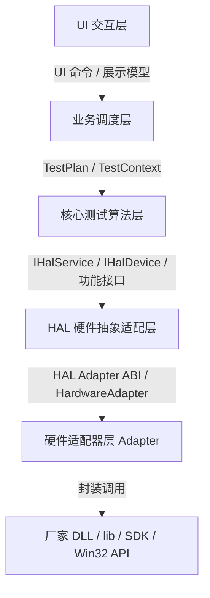

# HAL 层上下游接口协议设计

> 适用项目：多产品通用硬件测试软件（Qt 5.15 / C++ / Windows）  
> 设计范围：HAL 层对上“核心测试算法层”、对下“硬件适配器层 Adapter”的接口契约。  
> 当前范围：AD、DA、DI、DO、串口、CANFD。  
> 目标：测试算法不依赖具体板卡/厂家 DLL；Adapter 可替换、可新增；同一套测试流程可通过配置文件绑定不同硬件资源。

---

## 1. 分层边界

### 1.1 HAL 在五层架构中的位置



### 1.2 HAL 层职责

HAL 层负责把“具体硬件”抽象成统一的逻辑资源：

- 统一设备发现、打开、关闭、复位、健康检查。
- 统一 AD、DA、DI、DO、串口、CANFD 接口。
- 统一错误码、超时、重试、安全限制、日志和事件上报。
- 将配置文件中的逻辑资源映射到真实板卡、通道、总线端口。
- 隔离厂家 DLL/lib/SDK、调用约定、句柄和错误码差异。

---

## 2. 总体协议原则

### 2.1 HAL 对上接口原则

HAL 对测试算法层使用 C++/Qt 友好的接口：

- 使用 `QObject`/信号承载设备事件和日志事件。
- 使用 `QString`、`QByteArray`、`QVector`、`QVariantMap` 作为应用内部数据类型。
- 所有硬件调用必须带 `OperationOptions`，至少包含 `timeoutMs`。
- 所有返回值统一使用 `HalResult<T>` 或 `HalStatus`。
- 测试算法层只引用逻辑资源 ID，不引用厂家板卡句柄。

### 2.2 HAL 对 Adapter 接口原则

HAL 对下只面对我们自己定义的 Adapter 接口，不直接面对厂家 DLL/lib/SDK。Adapter 内部再调用厂家提供的 C 例程、DLL、lib 或 Win32 API。

- Adapter 可以是内置 C++ 类，也可以是外部 Adapter DLL。
- 外部 Adapter DLL 使用稳定 C ABI 导出函数表，避免编译器和 C++ ABI 差异。
- C ABI 只使用固定宽度整数、POD 结构体、调用方分配缓冲区、opaque handle。
- HAL 内部把 C ABI 包装成 C++ `HardwareAdapter` 对象。
- 厂家 DLL/lib/SDK 不直接被测试算法层或 HAL 上层接口调用，只允许被 Adapter 内部调用。

### 2.3 调用约定

一期默认使用带超时的同步调用，便于硬件测试流程稳定可控：

- 每个硬件动作必须设置超时。
- HAL 不做测试流程调度，只执行当前调用。
- 长耗时动作由业务调度层决定是否拆分步骤。
- 数据采样、总线监听等持续动作由显式 `start/stop` 或 `open/close` 接口表达。

---

## 3. 公共数据模型

建议命名空间：`hwtest::hal`。

### 3.1 基础类型

```cpp
namespace hwtest::hal {

using DeviceId = QString;      // HAL 生成的设备实例 ID，例如 "acme_daq_0"
using AdapterId = QString;     // Adapter ID，例如 "acme.daq.v1"
using ResourceId = QString;    // 逻辑资源 ID，例如 "AD_MAIN_0"、"CANFD_A"
using RequestId = QString;     // 测试项追踪 ID
using SessionId = QString;     // 打开后的设备会话 ID

}
```

| 名称 | C++ 类型 | 含义 |
| --- | --- | --- |
| `DeviceId` | `QString` | HAL 生成的设备实例 ID |
| `AdapterId` | `QString` | Adapter ID |
| `ResourceId` | `QString` | 逻辑资源 ID |
| `RequestId` | `QString` | 测试项追踪 ID |
| `SessionId` | `QString` | 打开后的设备会话 ID |

### 3.2 状态码

```cpp
enum class HalStatusCode {
    Ok = 0,
    InvalidArgument,
    InvalidState,
    NotInitialized,
    NotFound,
    NotSupported,
    PermissionDenied,
    Busy,
    Timeout,
    Cancelled,
    SafetyLimitExceeded,
    DeviceDisconnected,
    AdapterLoadFailed,
    AdapterSymbolMissing,
    AdapterError,
    IoError,
    ProtocolError,
    CrcMismatch,
    DataMismatch,
    BufferTooSmall,
    InternalError
};
```

| 状态码 | 含义 |
| --- | --- |
| `Ok` | 成功 |
| `InvalidArgument` | 参数非法 |
| `InvalidState` | 状态不允许 |
| `NotInitialized` | 未初始化 |
| `NotFound` | 未找到 |
| `NotSupported` | 不支持 |
| `PermissionDenied` | 权限不足 |
| `Busy` | 繁忙 |
| `Timeout` | 超时 |
| `Cancelled` | 已取消 |
| `SafetyLimitExceeded` | 超出安全限制 |
| `DeviceDisconnected` | 设备断开 |
| `AdapterLoadFailed` | Adapter 加载失败 |
| `AdapterSymbolMissing` | Adapter 符号缺失 |
| `AdapterError` | Adapter 侧错误 |
| `IoError` | IO 失败 |
| `ProtocolError` | 协议错误 |
| `CrcMismatch` | CRC 不匹配 |
| `DataMismatch` | 数据不匹配 |
| `BufferTooSmall` | 缓冲区不足 |
| `InternalError` | 内部错误 |

### 3.3 错误信息

```cpp
struct HalError {
    HalStatusCode code = HalStatusCode::Ok;
    QString message;           // 给日志/报告看的可读信息
    QString adapterCode;       // Adapter 统一后的错误码；厂家原始错误码放入 detail.vendorCode
    QString deviceId;
    QString resourceId;
    QString operation;         // 例如 "analog.read"、"canfd.send"
    QVariantMap detail;        // 附加上下文：通道、总线、超时、重试次数等
};

struct HalStatus {
    HalStatusCode code = HalStatusCode::Ok;
    HalError error;

    bool ok() const { return code == HalStatusCode::Ok; }
};

template <typename T>
struct HalResult {
    HalStatus status;
    T value;

    bool ok() const { return status.ok(); }
};
```

| 类型 | 字段 | 类型 | 含义 |
| --- | --- | --- | --- |
| `HalError` | `code` | `HalStatusCode` | 错误码 |
| `HalError` | `message` | `QString` | 可读错误信息 |
| `HalError` | `adapterCode` | `QString` | Adapter 统一后错误码 |
| `HalError` | `deviceId` | `QString` | 设备 ID |
| `HalError` | `resourceId` | `QString` | 资源 ID |
| `HalError` | `operation` | `QString` | 操作名 |
| `HalError` | `detail` | `QVariantMap` | 附加上下文 |
| `HalStatus` | `code` | `HalStatusCode` | 总状态码 |
| `HalStatus` | `error` | `HalError` | 错误详情 |
| `HalResult<T>` | `status` | `HalStatus` | 状态 |
| `HalResult<T>` | `value` | `T` | 返回值 |

### 3.4 操作选项

```cpp
struct OperationOptions {
    int timeoutMs = 1000;
    int retryCount = 0;
    int retryIntervalMs = 50;
    QString requestId;         // 由业务层传入，用于日志追踪
    QVariantMap tags;          // 产品型号、工位号、批次号等追踪字段
};
```

| 字段 | 类型 | 含义 |
| --- | --- | --- |
| `timeoutMs` | `int` | 超时毫秒 |
| `retryCount` | `int` | 重试次数 |
| `retryIntervalMs` | `int` | 重试间隔毫秒 |
| `requestId` | `QString` | 请求追踪 ID |
| `tags` | `QVariantMap` | 追踪标签 |

### 3.5 结构化日志事件

```cpp
struct HalLogEvent {
    qint64 timestampUs = 0;
    QString level;             // INFO / WARN / ERROR
    QString source;            // hal / adapter
    QString category;          // 例如 hal.analog.readAd
    QString message;
    QString requestId;         // 来自 OperationOptions
    qint64 durationMs = -1;    // HAL 计时
    QString status;            // 来自 HalStatusCode
    QString adapterCode;       // 来自 HalStatus.error.adapterCode
    QString deviceId;
    QString resourceId;
    QString operation;
    QVariantMap context;
};
```

### 3.6 设备与能力描述

```cpp
struct DeviceDescriptor {
    DeviceId deviceId;
    AdapterId adapterId;
    QString vendor;
    QString model;
    QString serialNumber;
    QString location;          // PCI 槽位、USB 路径、IP 地址等
    QString firmwareVersion;
    QVariantMap properties;
};

struct ChannelDescriptor {
    ResourceId resourceId;
    QString module;            // analog/digital/serial/canfd
    QString direction;         // input/output/bidirectional
    int physicalIndex = -1;     // 真实硬件通道号或总线号
    QVariantMap properties;     // 量程、分辨率、最大速率、电平标准等
};

struct DeviceCapabilities {
    DeviceDescriptor device;
    QVector<ChannelDescriptor> channels;
    QStringList supportedModules;
    QVariantMap limits;         // 最大采样率、最大帧长、安全输出范围等
};
```

| `DeviceDescriptor` 字段 | 类型 | 含义 |
| --- | --- | --- |
| `deviceId` | `DeviceId` | 设备实例 ID |
| `adapterId` | `AdapterId` | Adapter ID |
| `vendor` | `QString` | 厂商 |
| `model` | `QString` | 型号 |
| `serialNumber` | `QString` | 序列号 |
| `location` | `QString` | 位置 |
| `firmwareVersion` | `QString` | 固件版本 |
| `properties` | `QVariantMap` | 扩展属性 |

| `ChannelDescriptor` 字段 | 类型 | 含义 |
| --- | --- | --- |
| `resourceId` | `ResourceId` | 逻辑资源 ID |
| `module` | `QString` | 模块类型 |
| `direction` | `QString` | 方向 |
| `physicalIndex` | `int` | 物理通道号/总线号 |
| `properties` | `QVariantMap` | 通道属性 |

| `DeviceCapabilities` 字段 | 类型 | 含义 |
| --- | --- | --- |
| `device` | `DeviceDescriptor` | 设备描述 |
| `channels` | `QVector<ChannelDescriptor>` | 通道列表 |
| `supportedModules` | `QStringList` | 支持模块 |
| `limits` | `QVariantMap` | 能力限制 |

### 3.7 时间戳约定

- HAL 对上统一使用 `qint64 timestampUs`，表示 Unix epoch 微秒。
- 如果 Adapter 或厂家硬件接口提供硬件时间戳，HAL 同时保存到 `metadata.hardwareTimestamp`。
- 测试算法层不直接使用驱动私有时间基准。

---

## 4. HAL 对上：测试算法层接口

### 4.1 顶层服务接口 `IHalService`

`IHalService` 是测试算法层进入 HAL 的唯一入口。

```cpp
class IHalService : public QObject {
    Q_OBJECT
public:
    virtual ~IHalService() = default;

    virtual HalStatus initialize(const QVariantMap& halConfig) = 0;
    virtual HalStatus shutdown() = 0;

    virtual HalResult<QVector<DeviceDescriptor>> scanDevices(const OperationOptions& options) = 0;
    virtual HalResult<DeviceCapabilities> queryCapabilities(const DeviceId& deviceId,
                                                            const OperationOptions& options) = 0;

    virtual HalResult<SessionId> openDevice(const DeviceId& deviceId,
                                            const OperationOptions& options) = 0;
    virtual HalStatus closeDevice(const SessionId& sessionId,
                                  const OperationOptions& options) = 0;
    virtual HalStatus resetDevice(const SessionId& sessionId,
                                  const OperationOptions& options) = 0;
    virtual HalStatus healthCheck(const SessionId& sessionId,
                                  const OperationOptions& options) = 0;

    virtual HalResult<class IHalDevice*> device(const SessionId& sessionId) = 0;

signals:
    void deviceChanged(const DeviceDescriptor& device, const QString& state);
    void hardwareEvent(const QString& eventType, const QVariantMap& payload);
    void logProduced(const HalLogEvent& event);
    void logMessage(const QString& level, const QString& category, const QString& message, const QVariantMap& context);
};
```

| 方法 / 信号 | 输入 | 输出 | 含义 |
| --- | --- | --- | --- |
| `initialize` | `halConfig` | `HalStatus` | 初始化 HAL |
| `shutdown` | - | `HalStatus` | 关闭 HAL |
| `scanDevices` | `options` | `HalResult<QVector<DeviceDescriptor>>` | 扫描设备 |
| `queryCapabilities` | `deviceId`, `options` | `HalResult<DeviceCapabilities>` | 查询能力 |
| `openDevice` | `deviceId`, `options` | `HalResult<SessionId>` | 打开设备 |
| `closeDevice` | `sessionId`, `options` | `HalStatus` | 关闭设备 |
| `resetDevice` | `sessionId`, `options` | `HalStatus` | 复位设备 |
| `healthCheck` | `sessionId`, `options` | `HalStatus` | 健康检查 |
| `device` | `sessionId` | `HalResult<IHalDevice*>` | 获取设备对象 |
| `deviceChanged` | `device`, `state` | - | 设备状态变更 |
| `hardwareEvent` | `eventType`, `payload` | - | 硬件事件 |
| `logProduced` | `event` | - | 结构化日志上报，新代码优先连接 |
| `logMessage` | `level`, `category`, `message`, `context` | - | 兼容日志信号，旧 UI 可暂接 |

### 4.2 设备聚合接口 `IHalDevice`

`IHalDevice` 聚合一个设备或一个逻辑板卡组合的全部功能接口。

```cpp
class IHalDevice {
public:
    virtual ~IHalDevice() = default;

    virtual DeviceDescriptor descriptor() const = 0;
    virtual DeviceCapabilities capabilities() const = 0;

    virtual class IAnalogIo* analogIo() = 0;
    virtual class IDigitalIo* digitalIo() = 0;
    virtual class ISerialBus* serialBus() = 0;
    virtual class ICanFdBus* canFdBus() = 0;
};
```

| 方法 | 输入 | 输出 | 含义 |
| --- | --- | --- | --- |
| `descriptor` | - | `DeviceDescriptor` | 设备描述 |
| `capabilities` | - | `DeviceCapabilities` | 设备能力 |
| `analogIo` | - | `IAnalogIo*` | 模拟量接口 |
| `digitalIo` | - | `IDigitalIo*` | 数字量接口 |
| `serialBus` | - | `ISerialBus*` | 串口接口 |
| `canFdBus` | - | `ICanFdBus*` | CANFD 接口 |

### 4.3 AD/DA 接口 `IAnalogIo`

```cpp
enum class AnalogUnit {
    Volt,
    MilliVolt,
    Ampere,
    MilliAmpere,
    RawCount
};

struct AnalogRange {
    double minValue = 0.0;
    double maxValue = 0.0;
    AnalogUnit unit = AnalogUnit::Volt;
};

struct AnalogSample {
    ResourceId channel;
    double value = 0.0;
    AnalogUnit unit = AnalogUnit::Volt;
    qint64 timestampUs = 0;
    QVariantMap metadata;
};

struct AnalogReadOptions {
    OperationOptions op;
    AnalogRange range;
    int sampleCount = 1;
    int sampleRateHz = 0;      // 0 表示单次读取
    bool returnRaw = false;
};

struct AnalogWriteOptions {
    OperationOptions op;
    AnalogRange range;
    bool safeClamp = true;     // 超出安全范围时是否钳位；false 则报错
};

class IAnalogIo {
public:
    virtual ~IAnalogIo() = default;

    virtual HalStatus configureAd(const ResourceId& channel,
                                  const AnalogRange& range,
                                  const OperationOptions& options) = 0;
    virtual HalResult<AnalogSample> readAd(const ResourceId& channel,
                                           const AnalogReadOptions& options) = 0;
    virtual HalResult<QVector<AnalogSample>> readAdBatch(const QVector<ResourceId>& channels,
                                                         const AnalogReadOptions& options) = 0;

    virtual HalStatus configureDa(const ResourceId& channel,
                                  const AnalogRange& range,
                                  const OperationOptions& options) = 0;
    virtual HalStatus writeDa(const ResourceId& channel,
                              double value,
                              const AnalogWriteOptions& options) = 0;
    virtual HalStatus writeDaBatch(const QMap<ResourceId, double>& values,
                                   const AnalogWriteOptions& options) = 0;
};
```

| 类型 | 字段 / 方法 | 类型 | 含义 |
| --- | --- | --- | --- |
| `AnalogUnit` | `Volt` | 枚举 | 伏 |
| `AnalogUnit` | `MilliVolt` | 枚举 | 毫伏 |
| `AnalogUnit` | `Ampere` | 枚举 | 安培 |
| `AnalogUnit` | `MilliAmpere` | 枚举 | 毫安 |
| `AnalogUnit` | `RawCount` | 枚举 | 原始计数 |
| `AnalogRange` | `minValue` | `double` | 最小值 |
| `AnalogRange` | `maxValue` | `double` | 最大值 |
| `AnalogRange` | `unit` | `AnalogUnit` | 单位 |
| `AnalogSample` | `channel` | `ResourceId` | 通道 |
| `AnalogSample` | `value` | `double` | 采样值 |
| `AnalogSample` | `unit` | `AnalogUnit` | 单位 |
| `AnalogSample` | `timestampUs` | `qint64` | 时间戳 |
| `AnalogSample` | `metadata` | `QVariantMap` | 扩展数据 |
| `AnalogReadOptions` | `op` | `OperationOptions` | 操作选项 |
| `AnalogReadOptions` | `range` | `AnalogRange` | 读取量程 |
| `AnalogReadOptions` | `sampleCount` | `int` | 采样数 |
| `AnalogReadOptions` | `sampleRateHz` | `int` | 采样率 |
| `AnalogReadOptions` | `returnRaw` | `bool` | 是否返回 raw |
| `AnalogWriteOptions` | `op` | `OperationOptions` | 操作选项 |
| `AnalogWriteOptions` | `range` | `AnalogRange` | 写入量程 |
| `AnalogWriteOptions` | `safeClamp` | `bool` | 是否钳位 |

| `IAnalogIo` 方法 | 输入 | 输出 | 含义 |
| --- | --- | --- | --- |
| `configureAd` | `channel`, `range`, `options` | `HalStatus` | 配置 AD |
| `readAd` | `channel`, `options` | `HalResult<AnalogSample>` | 单次读取 |
| `readAdBatch` | `channels`, `options` | `HalResult<QVector<AnalogSample>>` | 批量读取 |
| `configureDa` | `channel`, `range`, `options` | `HalStatus` | 配置 DA |
| `writeDa` | `channel`, `value`, `options` | `HalStatus` | 单次写入 |
| `writeDaBatch` | `values`, `options` | `HalStatus` | 批量写入 |

约定：

- 测试算法层传入工程值（V/mA），HAL 负责与底层 raw count 转换。
- 安全量程由配置文件和设备能力共同决定，HAL 必须先校验再下发。
- `readAdBatch` 应尽量使用 Adapter 批量接口，保证多通道时间一致性。

### 4.4 DI/DO 接口 `IDigitalIo`

```cpp
enum class DigitalLevel {
    Low = 0,
    High = 1,
    Unknown = 2
};

struct DigitalSample {
    ResourceId channel;
    DigitalLevel level = DigitalLevel::Unknown;
    qint64 timestampUs = 0;
    QVariantMap metadata;
};

struct DigitalWriteOptions {
    OperationOptions op;
    bool verifyAfterWrite = true;
};

class IDigitalIo {
public:
    virtual ~IDigitalIo() = default;

    virtual HalResult<DigitalSample> readDi(const ResourceId& channel,
                                            const OperationOptions& options) = 0;
    virtual HalResult<QVector<DigitalSample>> readDiBatch(const QVector<ResourceId>& channels,
                                                          const OperationOptions& options) = 0;

    virtual HalStatus writeDo(const ResourceId& channel,
                              DigitalLevel level,
                              const DigitalWriteOptions& options) = 0;
    virtual HalStatus writeDoBatch(const QMap<ResourceId, DigitalLevel>& values,
                                   const DigitalWriteOptions& options) = 0;

    virtual HalResult<DigitalSample> waitEdge(const ResourceId& channel,
                                              DigitalLevel targetLevel,
                                              const OperationOptions& options) = 0;
};
```

| 类型 | 字段 / 方法 | 类型 | 含义 |
| --- | --- | --- | --- |
| `DigitalLevel` | `Low` | 枚举 | 低电平 |
| `DigitalLevel` | `High` | 枚举 | 高电平 |
| `DigitalLevel` | `Unknown` | 枚举 | 未知 |
| `DigitalSample` | `channel` | `ResourceId` | 通道 |
| `DigitalSample` | `level` | `DigitalLevel` | 电平 |
| `DigitalSample` | `timestampUs` | `qint64` | 时间戳 |
| `DigitalSample` | `metadata` | `QVariantMap` | 扩展数据 |
| `DigitalWriteOptions` | `op` | `OperationOptions` | 操作选项 |
| `DigitalWriteOptions` | `verifyAfterWrite` | `bool` | 写后验证 |

| `IDigitalIo` 方法 | 输入 | 输出 | 含义 |
| --- | --- | --- | --- |
| `readDi` | `channel`, `options` | `HalResult<DigitalSample>` | 单次读取 |
| `readDiBatch` | `channels`, `options` | `HalResult<QVector<DigitalSample>>` | 批量读取 |
| `writeDo` | `channel`, `level`, `options` | `HalStatus` | 单次写入 |
| `writeDoBatch` | `values`, `options` | `HalStatus` | 批量写入 |
| `waitEdge` | `channel`, `targetLevel`, `options` | `HalResult<DigitalSample>` | 等待边沿 |

约定：

- `writeDo` 默认写后读回验证，可由配置关闭。
- 输入去抖、输出保持时间属于 `properties` 或测试配置参数。
- 对继电器/高功率 DO，HAL 必须执行最小切换间隔保护。

### 4.5 串口接口 `ISerialBus`

```cpp
enum class SerialParity { None, Odd, Even, Mark, Space };
enum class SerialStopBits { One, OneAndHalf, Two };
enum class SerialFlowControl { None, Hardware, Software };

struct SerialConfig {
    int baudRate = 115200;
    int dataBits = 8;
    SerialParity parity = SerialParity::None;
    SerialStopBits stopBits = SerialStopBits::One;
    SerialFlowControl flowControl = SerialFlowControl::None;
    QVariantMap vendorOptions;
};

struct SerialTransaction {
    QByteArray tx;
    QByteArray expectedPrefix;
    int readMinBytes = 0;
    int readMaxBytes = 4096;
    QByteArray terminator;
    OperationOptions op;
};

struct SerialTransactionResult {
    QByteArray rx;
    qint64 txTimestampUs = 0;
    qint64 rxTimestampUs = 0;
    QVariantMap metadata;
};

class ISerialBus {
public:
    virtual ~ISerialBus() = default;

    virtual HalStatus openSerial(const ResourceId& port,
                                 const SerialConfig& config,
                                 const OperationOptions& options) = 0;
    virtual HalStatus closeSerial(const ResourceId& port,
                                  const OperationOptions& options) = 0;
    virtual HalStatus flushSerial(const ResourceId& port,
                                  const OperationOptions& options) = 0;

    virtual HalStatus writeSerial(const ResourceId& port,
                                  const QByteArray& data,
                                  const OperationOptions& options) = 0;
    virtual HalResult<QByteArray> readSerial(const ResourceId& port,
                                             int maxBytes,
                                             const OperationOptions& options) = 0;
    virtual HalResult<SerialTransactionResult> transactSerial(const ResourceId& port,
                                                              const SerialTransaction& transaction) = 0;
};
```

| 类型 | 字段 / 方法 | 类型 | 含义 |
| --- | --- | --- | --- |
| `SerialParity` | `None` | 枚举 | 无校验 |
| `SerialParity` | `Odd` | 枚举 | 奇校验 |
| `SerialParity` | `Even` | 枚举 | 偶校验 |
| `SerialParity` | `Mark` | 枚举 | Mark 校验 |
| `SerialParity` | `Space` | 枚举 | Space 校验 |
| `SerialStopBits` | `One` | 枚举 | 1 位停止位 |
| `SerialStopBits` | `OneAndHalf` | 枚举 | 1.5 位停止位 |
| `SerialStopBits` | `Two` | 枚举 | 2 位停止位 |
| `SerialFlowControl` | `None` | 枚举 | 无流控 |
| `SerialFlowControl` | `Hardware` | 枚举 | 硬件流控 |
| `SerialFlowControl` | `Software` | 枚举 | 软件流控 |
| `SerialConfig` | `baudRate` | `int` | 波特率 |
| `SerialConfig` | `dataBits` | `int` | 数据位 |
| `SerialConfig` | `parity` | `SerialParity` | 校验位 |
| `SerialConfig` | `stopBits` | `SerialStopBits` | 停止位 |
| `SerialConfig` | `flowControl` | `SerialFlowControl` | 流控 |
| `SerialConfig` | `vendorOptions` | `QVariantMap` | 厂商选项 |
| `SerialTransaction` | `tx` | `QByteArray` | 发送数据 |
| `SerialTransaction` | `expectedPrefix` | `QByteArray` | 期望前缀 |
| `SerialTransaction` | `readMinBytes` | `int` | 最小读取字节 |
| `SerialTransaction` | `readMaxBytes` | `int` | 最大读取字节 |
| `SerialTransaction` | `terminator` | `QByteArray` | 结束符 |
| `SerialTransaction` | `op` | `OperationOptions` | 操作选项 |
| `SerialTransactionResult` | `rx` | `QByteArray` | 接收数据 |
| `SerialTransactionResult` | `txTimestampUs` | `qint64` | 发送时间戳 |
| `SerialTransactionResult` | `rxTimestampUs` | `qint64` | 接收时间戳 |
| `SerialTransactionResult` | `metadata` | `QVariantMap` | 扩展数据 |

| `ISerialBus` 方法 | 输入 | 输出 | 含义 |
| --- | --- | --- | --- |
| `openSerial` | `port`, `config`, `options` | `HalStatus` | 打开串口 |
| `closeSerial` | `port`, `options` | `HalStatus` | 关闭串口 |
| `flushSerial` | `port`, `options` | `HalStatus` | 刷新串口 |
| `writeSerial` | `port`, `data`, `options` | `HalStatus` | 写串口 |
| `readSerial` | `port`, `maxBytes`, `options` | `HalResult<QByteArray>` | 读串口 |
| `transactSerial` | `port`, `transaction` | `HalResult<SerialTransactionResult>` | 串口事务 |

约定：

- `transactSerial` 是测试算法优先使用的接口，HAL 内部处理写入、等待、读帧、超时。
- 帧校验（CRC/校验和）由测试算法或协议解析器负责；HAL 只保证字节收发可靠。
- 如果使用 PC 原生串口，底层 Adapter 可封装 Win32 `CreateFile`/`ReadFile`。

### 4.6 CANFD 接口 `ICanFdBus`

```cpp
struct CanFdConfig {
    int nominalBitrate = 500000;
    int dataBitrate = 2000000;
    bool fdEnabled = true;
    bool bitrateSwitch = true;
    bool loopback = false;
    QVariantMap vendorOptions;
};

struct CanFdFrame {
    quint32 id = 0;
    bool extendedId = false;
    bool fd = true;
    bool bitrateSwitch = true;
    bool remoteRequest = false;
    QByteArray payload;        // CAN: 0..8，CANFD: 0..64
    qint64 timestampUs = 0;
    QVariantMap metadata;
};

struct CanFdFilter {
    quint32 id = 0;
    quint32 mask = 0xFFFFFFFF;
    bool extendedId = false;
};

class ICanFdBus {
public:
    virtual ~ICanFdBus() = default;

    virtual HalStatus openCan(const ResourceId& bus,
                              const CanFdConfig& config,
                              const OperationOptions& options) = 0;
    virtual HalStatus closeCan(const ResourceId& bus,
                               const OperationOptions& options) = 0;
    virtual HalStatus setCanFilters(const ResourceId& bus,
                                    const QVector<CanFdFilter>& filters,
                                    const OperationOptions& options) = 0;
    virtual HalStatus sendCan(const ResourceId& bus,
                              const CanFdFrame& frame,
                              const OperationOptions& options) = 0;
    virtual HalResult<CanFdFrame> receiveCan(const ResourceId& bus,
                                             const OperationOptions& options) = 0;
    virtual HalResult<QVector<CanFdFrame>> receiveCanBatch(const ResourceId& bus,
                                                           int maxFrames,
                                                           const OperationOptions& options) = 0;
};
```

| 类型 | 字段 / 方法 | 类型 | 含义 |
| --- | --- | --- | --- |
| `CanFdConfig` | `nominalBitrate` | `int` | 仲裁波特率 |
| `CanFdConfig` | `dataBitrate` | `int` | 数据波特率 |
| `CanFdConfig` | `fdEnabled` | `bool` | 是否启用 CANFD |
| `CanFdConfig` | `bitrateSwitch` | `bool` | 是否启用 BRS |
| `CanFdConfig` | `loopback` | `bool` | 是否回环 |
| `CanFdConfig` | `vendorOptions` | `QVariantMap` | 厂商选项 |
| `CanFdFrame` | `id` | `quint32` | 帧 ID |
| `CanFdFrame` | `extendedId` | `bool` | 扩展帧 |
| `CanFdFrame` | `fd` | `bool` | CANFD 帧 |
| `CanFdFrame` | `bitrateSwitch` | `bool` | 位速率切换 |
| `CanFdFrame` | `remoteRequest` | `bool` | 远程帧 |
| `CanFdFrame` | `payload` | `QByteArray` | 负载 |
| `CanFdFrame` | `timestampUs` | `qint64` | 时间戳 |
| `CanFdFrame` | `metadata` | `QVariantMap` | 扩展数据 |
| `CanFdFilter` | `id` | `quint32` | 过滤 ID |
| `CanFdFilter` | `mask` | `quint32` | 过滤掩码 |
| `CanFdFilter` | `extendedId` | `bool` | 扩展 ID |

| `ICanFdBus` 方法 | 输入 | 输出 | 含义 |
| --- | --- | --- | --- |
| `openCan` | `bus`, `config`, `options` | `HalStatus` | 打开总线 |
| `closeCan` | `bus`, `options` | `HalStatus` | 关闭总线 |
| `setCanFilters` | `bus`, `filters`, `options` | `HalStatus` | 设置过滤器 |
| `sendCan` | `bus`, `frame`, `options` | `HalStatus` | 发送帧 |
| `receiveCan` | `bus`, `options` | `HalResult<CanFdFrame>` | 接收帧 |
| `receiveCanBatch` | `bus`, `maxFrames`, `options` | `HalResult<QVector<CanFdFrame>>` | 批量接收 |

约定：

- HAL 校验 CANFD payload 长度与 DLC 合法性。
- 时间戳统一转为微秒；原始驱动时间戳放入 `metadata.hardwareTimestamp`。
- 总线错误、仲裁丢失、bus-off 必须映射为 `ProtocolError` 或 `IoError`，并保留底层错误码。

---

## 5. HAL 对下：Adapter 接口协议

### 5.1 Adapter 层定位

Adapter 是我们开发的硬件适配层，负责把统一 HAL 调用转换为厂家 DLL/lib/SDK 调用。推荐两种形态：

| 形态 | 使用场景 | 约束 |
| --- | --- | --- |
| 内置 C++ Adapter | 与主程序同编译器、同进程构建 | 开发快，适合一期单厂家快速落地 |
| 外部 Adapter DLL | 厂家 DLL/lib/SDK、MSVC/MinGW ABI 不确定、需独立替换 | 必须按本文 C ABI 导出函数表 |

一期可以先实现内置 Adapter；但接口语义仍按本文 ABI 设计，这样后续拆成独立 DLL 或新增厂家时不用改 HAL 和测试算法。

### 5.2 外部 Adapter DLL 导出入口

如果 Adapter 采用外部 DLL 形态，必须导出一个 C 函数：

```cpp
extern "C" __declspec(dllexport)
int hal_adapter_get_api_v1(const HalAdapterHostApiV1* host,
                          HalAdapterApiV1* outApi);
```

约定：

- 返回 `0` 表示成功，非 `0` 表示失败。
- `host` 由 HAL 提供，包含日志和时间辅助函数。
- `outApi` 由 HAL 分配，Adapter 填充函数指针。
- ABI 版本不匹配时必须返回失败，不允许部分初始化。

### 5.3 C ABI 基础类型

```cpp
#define HAL_ADAPTER_ABI_VERSION 1
#define HAL_ADAPTER_MAX_TEXT 256
#define HAL_ADAPTER_MAX_ID 128

#ifdef _MSC_VER
#define HAL_ADAPTER_CALL __stdcall
#else
#define HAL_ADAPTER_CALL
#endif

typedef void* HalAdapterHandle;
typedef void* HalAdapterDeviceHandle;

typedef enum HalAdapterStatusCode {
    HAL_ADAPTER_OK = 0,
    HAL_ADAPTER_INVALID_ARGUMENT = 1,
    HAL_ADAPTER_NOT_FOUND = 2,
    HAL_ADAPTER_NOT_SUPPORTED = 3,
    HAL_ADAPTER_BUSY = 4,
    HAL_ADAPTER_TIMEOUT = 5,
    HAL_ADAPTER_IO_ERROR = 6,
    HAL_ADAPTER_PROTOCOL_ERROR = 7,
    HAL_ADAPTER_DEVICE_DISCONNECTED = 8,
    HAL_ADAPTER_BUFFER_TOO_SMALL = 9,
    HAL_ADAPTER_INTERNAL_ERROR = 100
} HalAdapterStatusCode;

typedef struct HalAdapterStatus {
    int code;
    int vendorCode;
    char message[HAL_ADAPTER_MAX_TEXT];
} HalAdapterStatus;
```

| 类型 | 字段 | 类型 | 含义 |
| --- | --- | --- | --- |
| `HalAdapterStatusCode` | `HAL_ADAPTER_OK` | 枚举 | 成功 |
| `HalAdapterStatusCode` | `HAL_ADAPTER_INVALID_ARGUMENT` | 枚举 | 参数非法 |
| `HalAdapterStatusCode` | `HAL_ADAPTER_NOT_FOUND` | 枚举 | 未找到 |
| `HalAdapterStatusCode` | `HAL_ADAPTER_NOT_SUPPORTED` | 枚举 | 不支持 |
| `HalAdapterStatusCode` | `HAL_ADAPTER_BUSY` | 枚举 | 繁忙 |
| `HalAdapterStatusCode` | `HAL_ADAPTER_TIMEOUT` | 枚举 | 超时 |
| `HalAdapterStatusCode` | `HAL_ADAPTER_IO_ERROR` | 枚举 | IO 错误 |
| `HalAdapterStatusCode` | `HAL_ADAPTER_PROTOCOL_ERROR` | 枚举 | 协议错误 |
| `HalAdapterStatusCode` | `HAL_ADAPTER_DEVICE_DISCONNECTED` | 枚举 | 设备断开 |
| `HalAdapterStatusCode` | `HAL_ADAPTER_BUFFER_TOO_SMALL` | 枚举 | 缓冲区不足 |
| `HalAdapterStatusCode` | `HAL_ADAPTER_INTERNAL_ERROR` | 枚举 | 内部错误 |
| `HalAdapterStatus` | `code` | `int` | 状态码 |
| `HalAdapterStatus` | `vendorCode` | `int` | 厂家错误码 |
| `HalAdapterStatus` | `message` | `char[]` | 错误信息 |

### 5.4 Host API

```cpp
typedef void (HAL_ADAPTER_CALL *HalAdapterLogFn)(int level,
                                               const char* category,
                                               const char* message,
                                               const char* jsonContext);

typedef long long (HAL_ADAPTER_CALL *HalAdapterNowUsFn)();

typedef struct HalAdapterHostApiV1 {
    int abiVersion;
    HalAdapterLogFn log;
    HalAdapterNowUsFn nowUs;
} HalAdapterHostApiV1;
```

| 类型 | 字段 / 方法 | 类型 | 含义 |
| --- | --- | --- | --- |
| `HalAdapterLogFn` | `level` | `int` | 日志级别 |
| `HalAdapterLogFn` | `category` | `const char*` | 日志分类 |
| `HalAdapterLogFn` | `message` | `const char*` | 日志内容 |
| `HalAdapterLogFn` | `jsonContext` | `const char*` | JSON 上下文 |
| `HalAdapterNowUsFn` | 返回值 | `long long` | 当前微秒时间 |
| `HalAdapterHostApiV1` | `abiVersion` | `int` | ABI 版本 |
| `HalAdapterHostApiV1` | `log` | `HalAdapterLogFn` | 日志函数 |
| `HalAdapterHostApiV1` | `nowUs` | `HalAdapterNowUsFn` | 当前时间函数 |

约定：

- Adapter 不得直接写 UI，只能通过 `host.log` 上报。
- `jsonContext` 使用 UTF-8 JSON 字符串，允许为空。
- Adapter 不得在 `shutdown` 后继续使用 `host`。

### 5.5 Adapter 信息与设备枚举

```cpp
typedef struct HalAdapterInfo {
    char adapterId[HAL_ADAPTER_MAX_ID];
    char vendor[HAL_ADAPTER_MAX_TEXT];
    char name[HAL_ADAPTER_MAX_TEXT];
    char version[HAL_ADAPTER_MAX_TEXT];
    unsigned int supportedModulesMask;
    unsigned int flags;
} HalAdapterInfo;

typedef struct HalAdapterDeviceInfo {
    char deviceId[HAL_ADAPTER_MAX_ID];
    char model[HAL_ADAPTER_MAX_TEXT];
    char serialNumber[HAL_ADAPTER_MAX_TEXT];
    char location[HAL_ADAPTER_MAX_TEXT];
    char firmwareVersion[HAL_ADAPTER_MAX_TEXT];
    unsigned int supportedModulesMask;
    char propertiesJson[2048];
} HalAdapterDeviceInfo;
```

| 类型 | 字段 | 类型 | 含义 |
| --- | --- | --- | --- |
| `HalAdapterInfo` | `adapterId` | `char[]` | Adapter ID |
| `HalAdapterInfo` | `vendor` | `char[]` | 厂商 |
| `HalAdapterInfo` | `name` | `char[]` | 名称 |
| `HalAdapterInfo` | `version` | `char[]` | 版本 |
| `HalAdapterInfo` | `supportedModulesMask` | `unsigned int` | 支持模块位 |
| `HalAdapterInfo` | `flags` | `unsigned int` | 标志位 |
| `HalAdapterDeviceInfo` | `deviceId` | `char[]` | 设备 ID |
| `HalAdapterDeviceInfo` | `model` | `char[]` | 型号 |
| `HalAdapterDeviceInfo` | `serialNumber` | `char[]` | 序列号 |
| `HalAdapterDeviceInfo` | `location` | `char[]` | 位置 |
| `HalAdapterDeviceInfo` | `firmwareVersion` | `char[]` | 固件版本 |
| `HalAdapterDeviceInfo` | `supportedModulesMask` | `unsigned int` | 支持模块位 |
| `HalAdapterDeviceInfo` | `propertiesJson` | `char[]` | 属性 JSON |

模块位定义：

```cpp
#define HAL_MODULE_ANALOG     0x00000001u
#define HAL_MODULE_DIGITAL    0x00000002u
#define HAL_MODULE_SERIAL     0x00000004u
#define HAL_MODULE_CANFD      0x00000008u
```

枚举函数：

```cpp
typedef HalAdapterStatus (HAL_ADAPTER_CALL *HalAdapterGetInfoFn)(HalAdapterInfo* outInfo);

typedef HalAdapterStatus (HAL_ADAPTER_CALL *HalAdapterInitializeFn)(const char* configJson,
                                                                 HalAdapterHandle* outHandle);

typedef HalAdapterStatus (HAL_ADAPTER_CALL *HalAdapterShutdownFn)(HalAdapterHandle handle);

typedef HalAdapterStatus (HAL_ADAPTER_CALL *HalAdapterEnumerateFn)(HalAdapterHandle handle,
                                                                HalAdapterDeviceInfo* outDevices,
                                                                int* inoutCount,
                                                                int timeoutMs);
```

| 函数 | 输入 | 输出 | 含义 |
| --- | --- | --- | --- |
| `HalAdapterGetInfoFn` | `outInfo` | `HalAdapterStatus` | 获取 Adapter 信息 |
| `HalAdapterInitializeFn` | `configJson`, `outHandle` | `HalAdapterStatus` | 初始化 Adapter |
| `HalAdapterShutdownFn` | `handle` | `HalAdapterStatus` | 关闭 Adapter |
| `HalAdapterEnumerateFn` | `handle`, `outDevices`, `inoutCount`, `timeoutMs` | `HalAdapterStatus` | 枚举设备 |

约定：

- `outDevices == nullptr` 或 `*inoutCount` 不足时，返回 `BUFFER_TOO_SMALL` 并写入需要数量。
- `configJson` 来自 HAL 配置，可包含 DLL 路径、设备白名单、模拟模式等。

### 5.6 设备生命周期函数

```cpp
typedef HalAdapterStatus (HAL_ADAPTER_CALL *HalAdapterOpenDeviceFn)(HalAdapterHandle handle,
                                                                 const char* deviceId,
                                                                 const char* openOptionsJson,
                                                                 HalAdapterDeviceHandle* outDevice);

typedef HalAdapterStatus (HAL_ADAPTER_CALL *HalAdapterCloseDeviceFn)(HalAdapterDeviceHandle device);

typedef HalAdapterStatus (HAL_ADAPTER_CALL *HalAdapterResetDeviceFn)(HalAdapterDeviceHandle device,
                                                                  int timeoutMs);

typedef HalAdapterStatus (HAL_ADAPTER_CALL *HalAdapterGetCapabilitiesFn)(HalAdapterDeviceHandle device,
                                                                      char* outJson,
                                                                      int* inoutBytes,
                                                                      int timeoutMs);
```

| 函数 | 输入 | 输出 | 含义 |
| --- | --- | --- | --- |
| `HalAdapterOpenDeviceFn` | `handle`, `deviceId`, `openOptionsJson`, `outDevice` | `HalAdapterStatus` | 打开设备 |
| `HalAdapterCloseDeviceFn` | `device` | `HalAdapterStatus` | 关闭设备 |
| `HalAdapterResetDeviceFn` | `device`, `timeoutMs` | `HalAdapterStatus` | 复位设备 |
| `HalAdapterGetCapabilitiesFn` | `device`, `outJson`, `inoutBytes`, `timeoutMs` | `HalAdapterStatus` | 获取能力 |

能力 JSON 最少包含：

```json
{
  "channels": [
    {"resourceId": "AD0", "module": "analog", "direction": "input", "physicalIndex": 0},
    {"resourceId": "CANFD0", "module": "canfd", "direction": "bidirectional", "physicalIndex": 0}
  ],
  "limits": {
    "analog.maxSampleRateHz": 100000,
    "canfd.maxPayloadBytes": 64
  }
}
```

### 5.7 Analog Adapter 函数表

```cpp
typedef struct HalAdapterAnalogRange {
    double minValue;
    double maxValue;
    int unit;                 // 0=Volt,1=mV,2=A,3=mA,100=RawCount
} HalAdapterAnalogRange;

typedef struct HalAdapterAnalogSample {
    int channelIndex;
    double value;
    int unit;
    int rawCount;
    long long timestampUs;
    int statusFlags;
} HalAdapterAnalogSample;

typedef HalAdapterStatus (HAL_ADAPTER_CALL *HalAdapterAnalogConfigureFn)(HalAdapterDeviceHandle device,
                                                                      int channelIndex,
                                                                      const HalAdapterAnalogRange* range,
                                                                      int isOutput,
                                                                      int timeoutMs);

typedef HalAdapterStatus (HAL_ADAPTER_CALL *HalAdapterAnalogReadFn)(HalAdapterDeviceHandle device,
                                                                 const int* channelIndexes,
                                                                 int channelCount,
                                                                 HalAdapterAnalogSample* outSamples,
                                                                 int sampleCountPerChannel,
                                                                 int sampleRateHz,
                                                                 int timeoutMs);

typedef HalAdapterStatus (HAL_ADAPTER_CALL *HalAdapterAnalogWriteFn)(HalAdapterDeviceHandle device,
                                                                  const int* channelIndexes,
                                                                  const double* values,
                                                                  int channelCount,
                                                                  int unit,
                                                                  int timeoutMs);
```

| 类型 / 函数 | 输入 | 输出 | 含义 |
| --- | --- | --- | --- |
| `HalAdapterAnalogRange` | `minValue`, `maxValue`, `unit` | - | 模拟量量程 |
| `HalAdapterAnalogSample` | `channelIndex`, `value`, `unit`, `rawCount`, `timestampUs`, `statusFlags` | - | 模拟量采样 |
| `HalAdapterAnalogConfigureFn` | `device`, `channelIndex`, `range`, `isOutput`, `timeoutMs` | `HalAdapterStatus` | 配置模拟量 |
| `HalAdapterAnalogReadFn` | `device`, `channelIndexes`, `channelCount`, `outSamples`, `sampleCountPerChannel`, `sampleRateHz`, `timeoutMs` | `HalAdapterStatus` | 读取模拟量 |
| `HalAdapterAnalogWriteFn` | `device`, `channelIndexes`, `values`, `channelCount`, `unit`, `timeoutMs` | `HalAdapterStatus` | 写入模拟量 |

### 5.8 Digital Adapter 函数表

```cpp
typedef struct HalAdapterDigitalSample {
    int channelIndex;
    int level;                // 0=Low,1=High,2=Unknown
    long long timestampUs;
    int statusFlags;
} HalAdapterDigitalSample;

typedef HalAdapterStatus (HAL_ADAPTER_CALL *HalAdapterDigitalReadFn)(HalAdapterDeviceHandle device,
                                                                  const int* channelIndexes,
                                                                  int channelCount,
                                                                  HalAdapterDigitalSample* outSamples,
                                                                  int timeoutMs);

typedef HalAdapterStatus (HAL_ADAPTER_CALL *HalAdapterDigitalWriteFn)(HalAdapterDeviceHandle device,
                                                                   const int* channelIndexes,
                                                                   const int* levels,
                                                                   int channelCount,
                                                                   int timeoutMs);

typedef HalAdapterStatus (HAL_ADAPTER_CALL *HalAdapterDigitalWaitEdgeFn)(HalAdapterDeviceHandle device,
                                                                      int channelIndex,
                                                                      int targetLevel,
                                                                      HalAdapterDigitalSample* outSample,
                                                                      int timeoutMs);
```

| 类型 / 函数 | 输入 | 输出 | 含义 |
| --- | --- | --- | --- |
| `HalAdapterDigitalSample` | `channelIndex`, `level`, `timestampUs`, `statusFlags` | - | 数字量采样 |
| `HalAdapterDigitalReadFn` | `device`, `channelIndexes`, `channelCount`, `outSamples`, `timeoutMs` | `HalAdapterStatus` | 读取 DI |
| `HalAdapterDigitalWriteFn` | `device`, `channelIndexes`, `levels`, `channelCount`, `timeoutMs` | `HalAdapterStatus` | 写 DO |
| `HalAdapterDigitalWaitEdgeFn` | `device`, `channelIndex`, `targetLevel`, `outSample`, `timeoutMs` | `HalAdapterStatus` | 等待边沿 |

### 5.9 Serial Adapter 函数表

```cpp
typedef struct HalAdapterSerialConfig {
    int baudRate;
    int dataBits;
    int parity;
    int stopBits;
    int flowControl;
    char optionsJson[1024];
} HalAdapterSerialConfig;

typedef HalAdapterStatus (HAL_ADAPTER_CALL *HalAdapterSerialOpenFn)(HalAdapterDeviceHandle device,
                                                                 int portIndex,
                                                                 const HalAdapterSerialConfig* config,
                                                                 int timeoutMs);

typedef HalAdapterStatus (HAL_ADAPTER_CALL *HalAdapterSerialCloseFn)(HalAdapterDeviceHandle device,
                                                                  int portIndex,
                                                                  int timeoutMs);

typedef HalAdapterStatus (HAL_ADAPTER_CALL *HalAdapterSerialWriteFn)(HalAdapterDeviceHandle device,
                                                                  int portIndex,
                                                                  const unsigned char* data,
                                                                  int bytes,
                                                                  int* outWritten,
                                                                  int timeoutMs);

typedef HalAdapterStatus (HAL_ADAPTER_CALL *HalAdapterSerialReadFn)(HalAdapterDeviceHandle device,
                                                                 int portIndex,
                                                                 unsigned char* outData,
                                                                 int* inoutBytes,
                                                                 int timeoutMs);
```

| 类型 / 函数 | 输入 | 输出 | 含义 |
| --- | --- | --- | --- |
| `HalAdapterSerialConfig` | `baudRate`, `dataBits`, `parity`, `stopBits`, `flowControl`, `optionsJson` | - | 串口配置 |
| `HalAdapterSerialOpenFn` | `device`, `portIndex`, `config`, `timeoutMs` | `HalAdapterStatus` | 打开串口 |
| `HalAdapterSerialCloseFn` | `device`, `portIndex`, `timeoutMs` | `HalAdapterStatus` | 关闭串口 |
| `HalAdapterSerialWriteFn` | `device`, `portIndex`, `data`, `bytes`, `outWritten`, `timeoutMs` | `HalAdapterStatus` | 写串口 |
| `HalAdapterSerialReadFn` | `device`, `portIndex`, `outData`, `inoutBytes`, `timeoutMs` | `HalAdapterStatus` | 读串口 |

### 5.10 CANFD Adapter 函数表

```cpp
typedef struct HalAdapterCanFdConfig {
    int nominalBitrate;
    int dataBitrate;
    int fdEnabled;
    int bitrateSwitch;
    int loopback;
    char optionsJson[1024];
} HalAdapterCanFdConfig;

typedef struct HalAdapterCanFdFrame {
    unsigned int id;
    int extendedId;
    int fd;
    int bitrateSwitch;
    int remoteRequest;
    unsigned char payload[64];
    int payloadSize;
    long long timestampUs;
    int statusFlags;
} HalAdapterCanFdFrame;

typedef struct HalAdapterCanFdFilter {
    unsigned int id;
    unsigned int mask;
    int extendedId;
} HalAdapterCanFdFilter;

typedef HalAdapterStatus (HAL_ADAPTER_CALL *HalAdapterCanOpenFn)(HalAdapterDeviceHandle device,
                                                             int busIndex,
                                                             const HalAdapterCanFdConfig* config,
                                                             int timeoutMs);

typedef HalAdapterStatus (HAL_ADAPTER_CALL *HalAdapterCanCloseFn)(HalAdapterDeviceHandle device,
                                                              int busIndex,
                                                              int timeoutMs);

typedef HalAdapterStatus (HAL_ADAPTER_CALL *HalAdapterCanSetFiltersFn)(HalAdapterDeviceHandle device,
                                                                    int busIndex,
                                                                    const HalAdapterCanFdFilter* filters,
                                                                    int filterCount,
                                                                    int timeoutMs);

typedef HalAdapterStatus (HAL_ADAPTER_CALL *HalAdapterCanSendFn)(HalAdapterDeviceHandle device,
                                                             int busIndex,
                                                             const HalAdapterCanFdFrame* frame,
                                                             int timeoutMs);

typedef HalAdapterStatus (HAL_ADAPTER_CALL *HalAdapterCanReceiveFn)(HalAdapterDeviceHandle device,
                                                                int busIndex,
                                                                HalAdapterCanFdFrame* outFrames,
                                                                int* inoutFrameCount,
                                                                int timeoutMs);
```

| 类型 / 函数 | 输入 | 输出 | 含义 |
| --- | --- | --- | --- |
| `HalAdapterCanFdConfig` | `nominalBitrate`, `dataBitrate`, `fdEnabled`, `bitrateSwitch`, `loopback`, `optionsJson` | - | CANFD 配置 |
| `HalAdapterCanFdFrame` | `id`, `extendedId`, `fd`, `bitrateSwitch`, `remoteRequest`, `payload`, `payloadSize`, `timestampUs`, `statusFlags` | - | CANFD 帧 |
| `HalAdapterCanFdFilter` | `id`, `mask`, `extendedId` | - | 过滤器 |
| `HalAdapterCanOpenFn` | `device`, `busIndex`, `config`, `timeoutMs` | `HalAdapterStatus` | 打开总线 |
| `HalAdapterCanCloseFn` | `device`, `busIndex`, `timeoutMs` | `HalAdapterStatus` | 关闭总线 |
| `HalAdapterCanSetFiltersFn` | `device`, `busIndex`, `filters`, `filterCount`, `timeoutMs` | `HalAdapterStatus` | 设置过滤器 |
| `HalAdapterCanSendFn` | `device`, `busIndex`, `frame`, `timeoutMs` | `HalAdapterStatus` | 发送帧 |
| `HalAdapterCanReceiveFn` | `device`, `busIndex`, `outFrames`, `inoutFrameCount`, `timeoutMs` | `HalAdapterStatus` | 接收帧 |

### 5.11 总函数表 `HalAdapterApiV1`

```cpp
typedef struct HalAdapterApiV1 {
    int abiVersion;
    int structSize;

    HalAdapterGetInfoFn getInfo;
    HalAdapterInitializeFn initialize;
    HalAdapterShutdownFn shutdown;
    HalAdapterEnumerateFn enumerateDevices;

    HalAdapterOpenDeviceFn openDevice;
    HalAdapterCloseDeviceFn closeDevice;
    HalAdapterResetDeviceFn resetDevice;
    HalAdapterGetCapabilitiesFn getCapabilities;

    HalAdapterAnalogConfigureFn analogConfigure;
    HalAdapterAnalogReadFn analogRead;
    HalAdapterAnalogWriteFn analogWrite;

    HalAdapterDigitalReadFn digitalRead;
    HalAdapterDigitalWriteFn digitalWrite;
    HalAdapterDigitalWaitEdgeFn digitalWaitEdge;

    HalAdapterSerialOpenFn serialOpen;
    HalAdapterSerialCloseFn serialClose;
    HalAdapterSerialWriteFn serialWrite;
    HalAdapterSerialReadFn serialRead;

    HalAdapterCanOpenFn canOpen;
    HalAdapterCanCloseFn canClose;
    HalAdapterCanSetFiltersFn canSetFilters;
    HalAdapterCanSendFn canSend;
    HalAdapterCanReceiveFn canReceive;
} HalAdapterApiV1;
```

| 字段 | 类型 | 含义 |
| --- | --- | --- |
| `abiVersion` | `int` | ABI 版本 |
| `structSize` | `int` | 结构体大小 |
| `getInfo` | `HalAdapterGetInfoFn` | 获取 Adapter 信息 |
| `initialize` | `HalAdapterInitializeFn` | 初始化 |
| `shutdown` | `HalAdapterShutdownFn` | 关闭 |
| `enumerateDevices` | `HalAdapterEnumerateFn` | 枚举设备 |
| `openDevice` | `HalAdapterOpenDeviceFn` | 打开设备 |
| `closeDevice` | `HalAdapterCloseDeviceFn` | 关闭设备 |
| `resetDevice` | `HalAdapterResetDeviceFn` | 复位设备 |
| `getCapabilities` | `HalAdapterGetCapabilitiesFn` | 获取能力 |
| `analogConfigure` | `HalAdapterAnalogConfigureFn` | 配置模拟量 |
| `analogRead` | `HalAdapterAnalogReadFn` | 读取模拟量 |
| `analogWrite` | `HalAdapterAnalogWriteFn` | 写入模拟量 |
| `digitalRead` | `HalAdapterDigitalReadFn` | 读取数字量 |
| `digitalWrite` | `HalAdapterDigitalWriteFn` | 写入数字量 |
| `digitalWaitEdge` | `HalAdapterDigitalWaitEdgeFn` | 等待边沿 |
| `serialOpen` | `HalAdapterSerialOpenFn` | 打开串口 |
| `serialClose` | `HalAdapterSerialCloseFn` | 关闭串口 |
| `serialWrite` | `HalAdapterSerialWriteFn` | 写串口 |
| `serialRead` | `HalAdapterSerialReadFn` | 读串口 |
| `canOpen` | `HalAdapterCanOpenFn` | 打开 CANFD |
| `canClose` | `HalAdapterCanCloseFn` | 关闭 CANFD |
| `canSetFilters` | `HalAdapterCanSetFiltersFn` | 设置 CANFD 过滤器 |
| `canSend` | `HalAdapterCanSendFn` | 发送 CANFD |
| `canReceive` | `HalAdapterCanReceiveFn` | 接收 CANFD |

约定：

- 不支持的能力对应函数指针可以为 `nullptr`，HAL 调用前必须检查并返回 `NotSupported`。
- 所有字符串均为 UTF-8、以 `\0` 结尾。
- 所有阻塞函数必须尊重 `timeoutMs`。

---

## 6. HAL 内部映射规则

### 6.1 逻辑资源映射

`.testcfg` 中不直接写物理通道，推荐写逻辑资源：

```json
{
  "hardware": {
    "devices": [
      {
        "alias": "main_daq",
        "adapterId": "acme.daq.v1",
        "match": {"serialNumber": "DAQ-001"}
      }
    ],
    "resources": {
      "AD_MAIN_0": {"device": "main_daq", "module": "analog", "direction": "input", "physicalIndex": 0},
      "DA_MAIN_0": {"device": "main_daq", "module": "analog", "direction": "output", "physicalIndex": 0},
      "CANFD_A": {"device": "main_daq", "module": "canfd", "physicalIndex": 0},
      "SERIAL_A": {"device": "main_daq", "module": "serial", "physicalIndex": 0}
    }
  }
}
```

HAL 初始化后生成映射表：

```text
ResourceId -> DeviceSession -> AdapterDeviceHandle -> physicalIndex -> Adapter API
```

### 6.2 参数归一化

HAL 必须对以下内容归一化后再传给驱动：

- 量程单位：mV/mA 转换为Adapter 声明支持的单位。
- 总线帧：CANFD DLC 校验。
- 超时：测试算法未指定时使用配置默认值。
- 安全边界：电压/电流/输出频率/帧长度不得越过设备能力和配置限制。

### 6.3 错误映射

Adapter 错误到 HAL 错误映射：

| Adapter Code | HAL Code | 说明 |
| --- | --- | --- |
| `HAL_ADAPTER_OK` | `Ok` | 成功 |
| `INVALID_ARGUMENT` | `InvalidArgument` | 参数非法，通常是 HAL 调用问题或配置错误 |
| `NOT_FOUND` | `NotFound` | 设备/通道不存在 |
| `NOT_SUPPORTED` | `NotSupported` | Adapter 不支持该能力 |
| `BUSY` | `Busy` | 设备或端口忙 |
| `TIMEOUT` | `Timeout` | 超时 |
| `IO_ERROR` | `IoError` | Adapter 调用厂家 DLL/lib/SDK 或硬件 IO 失败 |
| `PROTOCOL_ERROR` | `ProtocolError` | 总线协议异常 |
| `DEVICE_DISCONNECTED` | `DeviceDisconnected` | 设备掉线 |
| `BUFFER_TOO_SMALL` | `BufferTooSmall` | 输出缓冲区不足 |
| `INTERNAL_ERROR` | `InternalError` | 未分类内部错误 |

HAL 返回给测试算法层时必须附带：

- `operation`
- `deviceId`
- `resourceId`
- `adapterCode`
- 底层 message
- 关键参数上下文

---

## 7. 生命周期协议

### 7.1 系统启动

```text
业务层读取 halConfig
  -> IHalService.initialize(halConfig)
  -> HAL 扫描/创建 adapters
  -> 加载 Adapter DLL / 获取 HalAdapterApiV1
  -> adapter.initialize(configJson)
  -> adapter.enumerateDevices()
  -> HAL 建立 DeviceDescriptor / Resource 映射
```

### 7.2 测试执行

```text
测试算法层请求资源 AD_MAIN_0
  -> HAL 查 Resource 映射
  -> 校验安全范围/能力
  -> 转换参数
  -> 调用 Adapter API
  -> 统一错误/数据格式
  -> 返回 HalResult<T>
```

### 7.3 系统关闭

```text
业务层停止测试
  -> HAL 停止采样/监听
  -> 输出通道进入安全状态
  -> closeDevice
  -> adapter.shutdown
  -> unload adapter DLL
```

---

## 8. 安全保护协议

### 8.1 输出安全

HAL 必须在以下操作前执行安全校验：

- DA 输出电压/电流。
- DO 输出电平和保持时间。
- CANFD 发送频率和帧长度。

### 8.2 安全状态

每个设备配置可声明 `safeState`：

```json
{
  "safeState": {
    "DA_MAIN_0": 0.0,
    "DO_POWER_EN": "Low",
    "CANFD_A": "closed"
  }
}
```

触发以下情况时 HAL 应进入安全状态：

- 测试流程取消。
- 设备异常断开。
- Adapter 调用返回严重 IO 错误。
- 输出超过安全限制。
- 应用退出。

---

## 9. 日志与追踪协议

### 9.1 日志字段

HAL 日志至少包含：

```json
{
  "timestampUs": 1710000000000000,
  "level": "INFO|WARN|ERROR",
  "category": "hal.analog.read",
  "requestId": "...",
  "deviceId": "...",
  "resourceId": "...",
  "operation": "analog.read",
  "durationMs": 12,
  "status": "Ok",
  "adapterCode": "0"
}
```

### 9.2 追踪 ID

- 业务层为每个测试项生成 `requestId`。
- HAL 所有日志、错误、事件必须携带该 `requestId`。
- HAL ↔ Adapter 接口无 requestId 参数时，HAL 在调用前后补齐日志。

### 9.3 字段来源和兼容信号

- `requestId` 来自当前调用的 `OperationOptions.requestId`。
- `durationMs` 由 HAL 用调用前后计时补齐。
- `status` 来自 `HalStatusCode`，成功为 `Ok`。
- `adapterCode` 来自 `HalStatus.error.adapterCode`。
- 新代码连接 `IHalService::logProduced(const HalLogEvent&)`。
- `IHalService::logMessage(...)` 仅作兼容信号；HAL 发 `logProduced` 时同步桥接旧信号，`context` 自动带 `requestId`、`durationMs`、`status`、`adapterCode`。

### 9.4 Adapter 日志边界

- 当前 `CAbiAdapter` 仍走 `MockAdapter`，不修改 `HAL_ADAPTER_ABI_VERSION`。
- 真实外部 Adapter 的 `host.log` 进入 HAL 后，转换为 `HalLogEvent{source="adapter"}` 再发给日志模块。
- 若未来要让 Adapter 原生携带 `requestId`，必须升级 Adapter ABI。

---

## 10. 典型调用示例

### 10.1 AD/DA 回环测试

```text
测试算法层 writeDa(DA_MAIN_0, 2.5V)
  -> HAL 校验 DA_MAIN_0 安全范围
  -> AdapterAnalogWrite(channel=0, value=2.5)
  -> 测试算法层 readAd(AD_MAIN_0)
  -> HAL 配置/读取 AD
  -> AdapterAnalogRead(channel=0)
  -> HAL 返回 AnalogSample(value=2.498V)
  -> 测试算法层按阈值判定 PASS/FAIL
```

### 10.2 CANFD 收发测试

```text
测试算法层 openCan(CANFD_A, 500K/2M)
  -> AdapterCanOpen(bus=0)
测试算法层 sendCan(frame)
  -> HAL 校验 DLC/payload
  -> AdapterCanSend
测试算法层 receiveCan(timeout=500ms)
  -> AdapterCanReceive
  -> HAL 映射时间戳/错误码
```

### 10.3 串口收发测试

```text
测试算法层 openSerial(SERIAL_A, 115200-8N1)
  -> AdapterSerialOpen(port=0)
测试算法层 transactSerial(tx, terminator, timeout)
  -> AdapterSerialWrite
  -> AdapterSerialRead
  -> HAL 返回 SerialTransactionResult
```

---

## 11. 推荐源码落地结构

```text
src/
  hal/
    include/
      hal_global.h
      hal_types.h
      i_hal_service.h
      i_hal_device.h
      i_analog_io.h
      i_digital_io.h
      i_serial_bus.h
      i_canfd_bus.h
      hal_adapter_abi.h
    core/
      hal_service.cpp
      hal_device.cpp
      resource_mapper.cpp
      error_mapper.cpp
    adapters/
      adapter_loader.cpp
      c_abi_adapter.cpp
      mock_adapter.cpp
```

---

## 12. 一期实现建议

### 12.1 必须先实现

- `hal_types.h`
- `hal_adapter_abi.h`
- `IHalService`
- `IHalDevice`
- `IAnalogIo`
- `IDigitalIo`
- `ISerialBus`
- `ICanFdBus`
- `ResourceMapper`
- `MockAdapter`

### 12.2 可延后实现

- 高速连续采样接口。
- 远程 HTTP/WebSocket 监控接口。
- 多进程驱动隔离。

### 12.3 Mock 驱动要求

为了在没有真实板卡时开发测试算法，必须提供 Mock Adapter：

- 支持当前范围内全部接口并可返回模拟数据。
- 可通过 JSON 配置固定返回值、随机噪声、超时、错误码。
- 支持 AD/DA 回环、DO/DI 回环、串口 echo、CANFD loopback。
- 所有 Mock Adapter 行为必须走同一套 HAL Adapter ABI，避免测试算法绕过 HAL。

---

## 13. 协议版本策略

- `HAL_ADAPTER_ABI_VERSION` 从 `1` 开始。
- 新增函数只能追加到 `HalAdapterApiV1` 尾部，并通过 `structSize` 判断兼容。
- 修改结构体字段语义必须升级 ABI 主版本。
- `.testcfg` 中记录 `halProtocolVersion`，便于后续兼容迁移。

示例：

```json
{
  "halProtocolVersion": 1,
  "requiredModules": ["analog", "digital", "serial", "canfd"]
}
```

---

## 14. 验收标准

HAL 接口实现完成后，应满足：

- 测试算法层可在不包含厂家 SDK 头文件的情况下编译。
- 更换板卡厂商时，只新增/替换 Adapter，不修改测试算法。
- 所有硬件操作都有统一超时、错误码、日志和 requestId。
- 没有真实硬件时，Mock Adapter 能跑通 AD/DA、DI/DO、串口、CANFD 的基础流程。
- Win7 低配模式下可按测试流程顺序执行全部接口。
