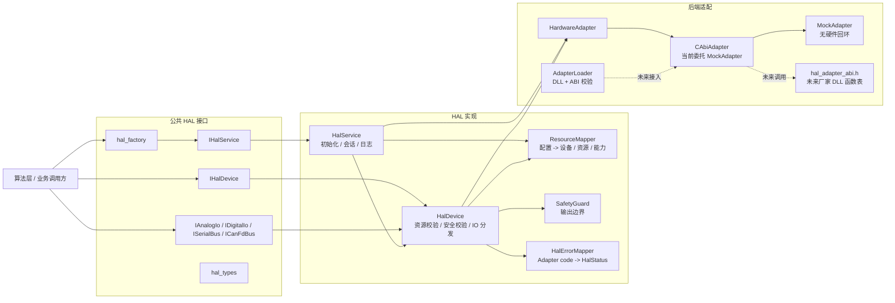
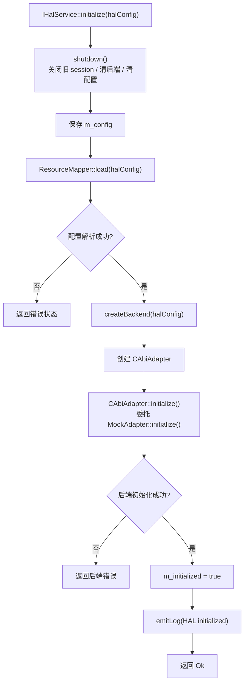
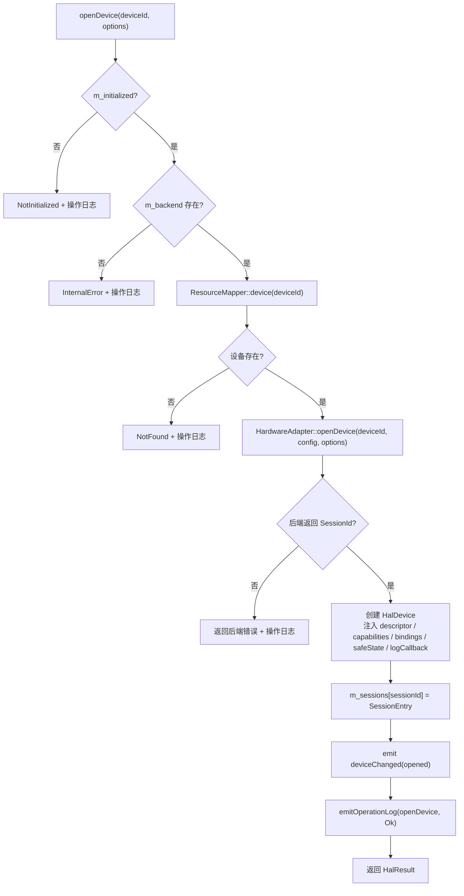
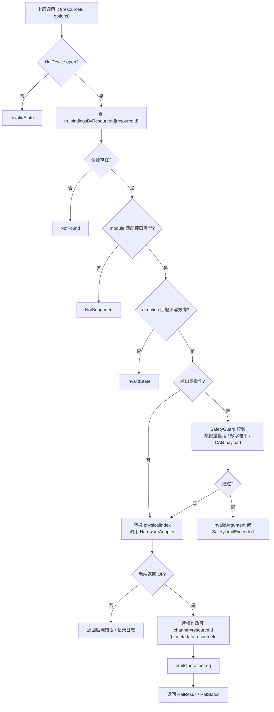
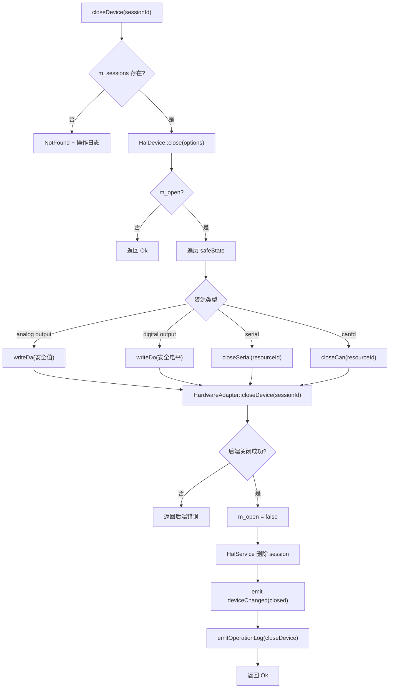
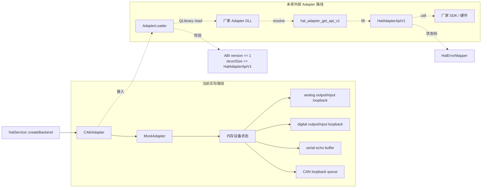

# HAL 实现设计报告

> 范围：`src/hal` 当前实现。
> 技术栈：Qt 5.15 / C++17。
> 目标：不读源码也能理解 HAL 当前怎么工作、怎么扩展、边界在哪。

---

## 1. 定位

HAL 是五层架构中的第 4 层，位于核心测试算法层和硬件 Adapter 层之间。

```text
算法层
  -> IHalService / IHalDevice / IAnalogIo / IDigitalIo / ISerialBus / ICanFdBus
  -> HAL 实现
  -> HardwareAdapter
  -> MockAdapter 或未来厂家 Adapter
```

当前架构：



HAL 当前负责：

- 用 Qt/C++ 接口向上提供设备、AD/DA、DI/DO、串口、CANFD 能力。
- 将逻辑资源 ID 映射为设备、模块、方向、物理通道。
- 校验资源存在性、模块类型、方向、安全范围。
- 管理设备会话和安全关闭。
- 统一返回 `HalStatus` / `HalResult<T>`。
- 产生 `HalLogEvent`，保留 `requestId`、操作名、设备、资源、耗时、状态。
- 提供 C ABI Adapter 函数表定义和 DLL 加载器骨架。
- 默认用 Mock 后端支撑无硬件开发和测试。

---

## 2. 目录

```text
src/hal/
  CMakeLists.txt
  include/hal/
    hal_global.h
    hal_types.h
    hal_adapter_abi.h
    hal_factory.h
    i_hal_service.h
    i_hal_device.h
    i_analog_io.h
    i_digital_io.h
    i_serial_bus.h
    i_canfd_bus.h
  src/
    hal_factory.cpp
    hal_types.cpp
    hal_error_mapper.*
    resource_mapper.*
    safety_guard.*
    hardware_adapter.h
    mock_adapter.*
    c_abi_adapter.*
    adapter_loader.*
    hal_service.*
    hal_device.*
```

公共兼容面在 `include/hal/`。内部实现、Mock 后端、加载器都在 `src/`。

---

## 3. 构建产物

`src/hal/CMakeLists.txt` 构建静态库：

```text
target: hwtest_hal
type: STATIC
depends: Qt Core
standard: C++17
namespace: hwtest::hal
```

库导出宏由 `hal_global.h` 定义。当前构建定义 `HWTEST_HAL_STATIC`，因此公共符号导出宏为空。

---

## 4. 公共类型

主文件：`include/hal/hal_types.h`。

核心 ID：

```text
DeviceId   = QString
AdapterId  = QString
ResourceId = QString
RequestId  = QString
SessionId  = QString
```

统一状态：

- `HalStatusCode`：统一错误码。
- `HalError`：错误详情，包含 operation、message、adapterCode、deviceId、resourceId、detail。
- `HalStatus`：只表示成功或失败。
- `HalResult<T>`：状态加返回值。

调用选项：

- `OperationOptions.timeoutMs` 默认 1000。
- `retryCount`、`retryIntervalMs` 预留重试语义。
- `requestId` 贯穿日志链路。
- `tags` 用于附加业务上下文。

设备和能力：

- `DeviceDescriptor` 描述设备 ID、厂商、型号、序列号、位置、固件、属性。
- `ChannelDescriptor` 描述逻辑资源、模块、方向、物理索引、属性。
- `DeviceCapabilities` 包含设备、通道列表、模块列表、限制。

IO 数据：

- 模拟量：`AnalogRange`、`AnalogSample`、`AnalogReadOptions`、`AnalogWriteOptions`。
- 数字量：`DigitalLevel`、`DigitalSample`、`DigitalWriteOptions`。
- 串口：`SerialConfig`、`SerialTransaction`、`SerialTransactionResult`。
- CANFD：`CanFdConfig`、`CanFdFrame`、`CanFdFilter`。

`hal_types.cpp` 注册 Qt 元类型，并提供枚举转字符串函数。

---

## 5. 对上接口

### 5.1 `IHalService`

主文件：`i_hal_service.h`。

职责：

- 初始化和关闭 HAL。
- 扫描设备。
- 查询能力。
- 打开/关闭/复位/健康检查设备。
- 通过 `SessionId` 取得 `IHalDevice*`。
- 通过 Qt signals 输出 `deviceChanged`、`hardwareEvent`、`logProduced`、`logMessage`。

典型调用：

```text
createHalService()
  -> initialize(halConfig)
  -> scanDevices()
  -> openDevice(deviceId)
  -> device(sessionId)
  -> IHalDevice 子接口执行 IO
  -> closeDevice(sessionId)
  -> shutdown()
```

### 5.2 `IHalDevice`

主文件：`i_hal_device.h`。

职责：

- 返回设备描述和能力。
- 暴露 4 类 IO 子接口：
  - `IAnalogIo`
  - `IDigitalIo`
  - `ISerialBus`
  - `ICanFdBus`

### 5.3 IO 子接口

`IAnalogIo`：

- `configureAd`、`readAd`、`readAdBatch`
- `configureDa`、`writeDa`、`writeDaBatch`

`IDigitalIo`：

- `readDi`、`readDiBatch`
- `writeDo`、`writeDoBatch`
- `waitEdge`

`ISerialBus`：

- `openSerial`、`closeSerial`、`flushSerial`
- `writeSerial`、`readSerial`
- `transactSerial`

`ICanFdBus`：

- `openCan`、`closeCan`
- `setCanFilters`
- `sendCan`、`receiveCan`、`receiveCanBatch`

对上只暴露逻辑资源 ID，不暴露物理通道和厂家句柄。

---

## 6. 工厂

主文件：`hal_factory.cpp`。

```text
createHalService(parent) -> new HalService(parent)
destroyHalService(ptr)   -> delete ptr
```

这是外部模块获取 HAL 服务的入口。

---

## 7. `HalService`

主文件：`hal_service.*`。

### 7.1 内部状态

```text
m_config       当前 HAL 配置
m_mapper       ResourceMapper
m_backend      HardwareAdapter 实例
m_sessions     SessionId -> {HalDevice, DeviceDescriptor}
m_initialized  初始化标志
```

### 7.2 初始化

当前流程：

```text
initialize(halConfig)
  -> shutdown() 清理旧状态
  -> 保存 m_config
  -> m_mapper.load(halConfig)
  -> createBackend(halConfig)
  -> backend.initialize(halConfig)
  -> m_initialized = true
  -> emit "HAL initialized" 日志
```



当前 `createBackend()` 总是创建 `CAbiAdapter`。`CAbiAdapter` 当前又委托给 `MockAdapter`，所以默认路径实际是 Mock 后端。

源码中有 `hasLibraryPath()` 和 `adapterConfig()` 辅助函数，但当前未接入 `createBackend()`，外部 DLL 加载尚未成为默认运行路径。

### 7.3 扫描和能力

`scanDevices()`：

- 未初始化返回 `NotInitialized`。
- 已初始化返回 `ResourceMapper::devices()`。

`queryCapabilities(deviceId)`：

- 未初始化返回 `NotInitialized`。
- 设备不存在返回 `NotFound`。
- 设备存在返回 `ResourceMapper::capabilities(deviceId)`。

当前扫描和能力来自配置映射，不直接调用后端枚举结果。

### 7.4 打开设备

流程：

```text
openDevice(deviceId, options)
  -> 校验已初始化
  -> 校验 backend 存在
  -> 查 ResourceMapper 里的 DeviceDescriptor
  -> backend.openDevice(deviceId, m_config, options)
  -> 创建 HalDevice
       backend = m_backend.get()
       sessionId = backend 返回值
       descriptor = mapper descriptor
       capabilities = mapper capabilities
       bindings = mapper.bindingsForDevice(deviceId)
       safeState = mapper.safeState()
       logCallback = 转发到 HalService::emitLogEvent
  -> m_sessions[sessionId] = SessionEntry
  -> emit deviceChanged(opened)
  -> emit openDevice 操作日志
```



### 7.5 会话操作

`closeDevice(sessionId)`：

- 找不到 session 返回 `NotFound` 并记录日志。
- 找到后调用 `HalDevice::close()`。
- 从 `m_sessions` 删除。
- 发 `deviceChanged(closed)`。

`resetDevice(sessionId)`：

- 找不到返回 `NotFound`。
- 找到后调用 `HalDevice::reset()`。
- 成功时发 `deviceChanged(reset)`。

`healthCheck(sessionId)`：

- 找不到返回 `NotFound`。
- 找到后调用 `HalDevice::healthCheck()`。

`device(sessionId)`：

- 找不到返回 `HalResult<IHalDevice*>` + `NotFound`。
- 找到返回内部 `HalDevice*`。

### 7.6 关闭

`shutdown()`：

```text
遍历所有 session
  -> device->close()
清空 m_sessions
backend->shutdown()
reset backend
m_initialized = false
m_config.clear()
```

关闭是幂等的；析构函数会调用 `shutdown()`。

### 7.7 日志

`HalService` 有两类日志工具：

- `emitLog()`：用于普通服务日志。
- `emitOperationLog()`：用于带耗时、状态、session、tags 的操作日志。

`emitLogEvent()` 会归一化字段：

- timestampUs 为空时补当前时间。
- source 为空时补 `hal`。
- requestId、durationMs、status、adapterCode、deviceId、resourceId、operation 同步写入 context。
- 同时发 `logProduced` 和兼容信号 `logMessage`。

---

## 8. `HalDevice`

主文件：`hal_device.*`。

`HalDevice` 同时实现：

```text
IHalDevice
IAnalogIo
IDigitalIo
ISerialBus
ICanFdBus
```

### 8.1 内部状态

```text
m_backend                   HardwareAdapter*
m_sessionId                 后端会话
m_descriptor                设备描述
m_capabilities              能力
m_safeState                 安全状态
m_bindingsByResourceId      ResourceId -> ResourceBinding
m_resourceIdByPhysicalIndex physicalIndex -> ResourceId
m_analogInputRanges         AD 配置缓存
m_analogOutputRanges        DA 配置缓存
m_openSerialPorts           串口配置缓存
m_openCanBuses              CAN 配置缓存
m_open                      会话是否打开
m_safetyGuard               安全校验
m_logCallback               日志回调
```

构造时接收设备资源绑定列表，并建立资源索引。

### 8.2 资源校验

核心函数是 `bindingFor(resourceId, module, expectedDirection, status)`。

校验顺序：

```text
会话是否 open
  -> 否：InvalidState
资源是否存在
  -> 否：NotFound
模块是否匹配
  -> 否：NotSupported
方向是否兼容
  -> 否：InvalidState
返回 ResourceBinding
```

方向规则：

- expected 为空或 `any`：允许。
- actual 等于 expected：允许。
- actual 为 `bidirectional`：允许读写双向接口。

模块比较会 trim + lower。

通用 IO 执行逻辑：



### 8.3 模拟量

`configureAd()` / `configureDa()`：

- 校验资源模块和方向。
- 缓存量程。
- 调 `backend.configureAnalog(sessionId, physicalIndex, range, output, options)`。
- 记录操作日志。

`readAd()`：

- 校验 input analog。
- 调 `backend.readAnalog()`。
- 将返回 sample 的 `channel` 改写为逻辑资源 ID。
- metadata 写入 `resourceId`。
- 记录日志。

`writeDa()`：

- 校验 output analog。
- 若调用未传有效 range，则用资源属性 `safeMinValue` / `safeMaxValue`，否则默认 0..5V。
- 通过 `SafetyGuard::validateAnalogWrite()` 做安全范围检查和钳位。
- 调 `backend.writeAnalog()`。
- 记录日志。

批量方法逐个调用单点方法，遇到第一处错误立即返回。

### 8.4 数字量

`readDi()`：

- 校验 input digital。
- 调 `backend.readDigital()`。
- 将 sample.channel 改为逻辑资源 ID。
- metadata 写入 `resourceId`。

`writeDo()`：

- 校验 output digital。
- `SafetyGuard` 禁止写 input、禁止写 `DigitalLevel::Unknown`。
- 调 `backend.writeDigital()`。

`waitEdge()`：

- 校验 input digital。
- 调 `backend.waitDigitalEdge()`。
- 成功后改写 channel。

批量方法逐个调用单点方法，遇错返回。

### 8.5 串口

`openSerial()`：

- 校验 serial + bidirectional。
- 缓存 `SerialConfig`。
- 调 `backend.openSerial()`。

`closeSerial()`：

- 校验资源。
- 删除缓存。
- 调 `backend.closeSerial()`。

`flushSerial()`：

- 校验资源。
- 调 `backend.flushSerial()`。
- 当前不发操作日志。

`writeSerial()` / `readSerial()`：

- 校验资源。
- 调后端读写。
- 记录日志。

`transactSerial()`：

```text
writeSerial(transaction.tx)
  -> readSerial(transaction.readMaxBytes)
  -> 返回 rx、txTimestampUs、rxTimestampUs、metadata.resourceId
```

当前没有在 HAL 层校验 `expectedPrefix`、`readMinBytes`、`terminator`。

### 8.6 CANFD

`openCan()` / `closeCan()`：

- 校验 canfd + bidirectional。
- 缓存或删除 `CanFdConfig`。
- 调后端。

`setCanFilters()`：

- 校验资源。
- 调 `backend.setCanFilters()`。
- 当前不发操作日志。

`sendCan()`：

- 校验资源。
- `SafetyGuard` 检查 payload 长度：CAN FD 最大 64，普通 CAN 最大 8。
- 调 `backend.sendCan()`。
- 记录日志。

`receiveCan()`：

- 校验资源。
- 调 `backend.receiveCan()`。
- 记录日志。

`receiveCanBatch()`：

- 校验资源。
- 调 `backend.receiveCanBatch()`。
- 当前不发操作日志。

### 8.7 关闭和安全状态

`close()` 流程：

```text
若 m_open == false
  -> 返回 Ok
applySafeState()
backend.closeDevice(sessionId)
m_open = false
记录 closeDevice 日志
```

`applySafeState()` 遍历 `m_safeState`：

- analog output：写安全电压。
- digital output：把 `"high"/"1"/"true"` 转 High，把 `"low"/"0"/"false"` 转 Low，否则 Unknown。
- serial：关闭串口。
- canfd：关闭 CAN。
- 忽略不存在资源。
- 保留第一个后端错误并返回。

`reset()` 和 `healthCheck()` 会校验 open 状态和 backend 是否存在，再调用后端。

安全关闭流程：



---

## 9. 资源映射

主文件：`resource_mapper.*`。

配置入口是 `QVariantMap halConfig`，当前读取结构：

```text
hardware.devices[]
hardware.resources{}
safeState{}
```

设备字段：

- `alias` -> `DeviceDescriptor.deviceId`
- `adapterId`
- `vendor`
- `model`
- `serialNumber`
- `location`
- `firmwareVersion`
- `properties`
- `match` 会写入 `properties["match"]`

资源字段：

- key -> `ResourceBinding.resourceId`
- `device`
- `adapterId`
- `module`
- `direction`，默认 `bidirectional`
- `physicalIndex`，默认 0
- `properties`

容错行为：

- 没有设备时创建默认设备 `mock_device_0`。
- 没有资源时创建默认 6 个资源：
  - `AD_MAIN_0`
  - `DA_MAIN_0`
  - `DI_POWER_OK`
  - `DO_POWER_EN`
  - `SERIAL_A`
  - `CANFD_A`
- 资源引用不存在设备但设备表非空时，绑定到首个设备。
- `adapterId` 为空时回退 `mock.adapter.v1`。

能力生成：

- 每个资源转为一个 `ChannelDescriptor`。
- `supportedModules` 来自资源模块去重。
- 固定写入限制：
  - `analog.maxSampleRateHz = 100000`
  - `canfd.maxPayloadBytes = 64`

---

## 10. 安全校验

主文件：`safety_guard.*`。

当前规则：

- 模拟量写：
  - 低于最小或高于最大时，若 `safeClamp=true`，钳位到边界并通过。
  - 若 `safeClamp=false`，返回 `SafetyLimitExceeded`。
- 数字量写：
  - 禁止写 input 资源，返回 `InvalidState`。
  - 禁止写 `Unknown`，返回 `InvalidArgument`。
- 串口配置：
  - baudRate 必须 > 0。
  - dataBits 必须在 5..8。
- CAN 帧：
  - `frame.fd=true` 时 payload 最大 64。
  - `frame.fd=false` 时 payload 最大 8。

`SafetyGuard` 构造可接收 `ResourceMapper*`，当前实现未使用 mapper。

---

## 11. 错误映射

主文件：`hal_error_mapper.*`。

`mapAdapterStatus()` 把 C ABI 状态码转成 `HalStatusCode`：

- invalid argument -> `InvalidArgument`
- not found -> `NotFound`
- not supported -> `NotSupported`
- busy -> `Busy`
- timeout -> `Timeout`
- io error -> `IoError`
- protocol error -> `ProtocolError`
- device disconnected -> `DeviceDisconnected`
- buffer too small -> `BufferTooSmall`
- internal error -> `InternalError`
- 未知值 -> `AdapterError`

`makeError()` 构造 `HalStatus` 并同步填充顶层 code 和嵌套 error。

`fromAdapterStatus()` 复制 Adapter message，vendorCode 以字符串形式写入 `adapterCode`。

---

## 12. 后端抽象

主文件：`hardware_adapter.h`。

`HardwareAdapter` 是 HAL 到后端的 C++ 抽象，方法覆盖：

- adapter 信息。
- initialize / shutdown。
- enumerate / capabilities。
- open / close / reset / healthCheck。
- analog configure / read / write / batch。
- digital read / write / wait edge / batch。
- serial open / close / flush / read / write / transaction。
- CAN open / close / filters / send / receive / batch。

`HalService` 和 `HalDevice` 只依赖 `HardwareAdapter`，不直接依赖 `MockAdapter`。

---

## 13. `CAbiAdapter`

主文件：`c_abi_adapter.*`。

当前 `CAbiAdapter` 是兼容 seam，不是真正 C ABI 桥接实现。所有方法直接委托给内部 `MockAdapter`。

设计含义：

- `HalService` 默认创建 `CAbiAdapter`。
- 因为 `CAbiAdapter` 委托 `MockAdapter`，当前系统无需厂家 DLL 也可工作。
- 未来可在此类中接入 `AdapterLoader` 和 `HalAdapterApiV1` 函数表。

当前 Mock 路径和未来外部 Adapter 路径：



---

## 14. `AdapterLoader`

主文件：`adapter_loader.*`。

职责：加载外部 Adapter DLL，并解析 C ABI 函数表入口。

流程：

```text
load(libraryPath, hostApi, outApi)
  -> unload() 清理旧库
  -> 校验 libraryPath 和 outApi
  -> QLibrary(libraryPath).load()
  -> resolve("hal_adapter_get_api_v1")
  -> 调 symbol(&hostApi, &api)
  -> 校验 api.abiVersion == HAL_ADAPTER_ABI_VERSION
  -> 校验 api.structSize >= sizeof(HalAdapterApiV1)
  -> 保存 api 和 libraryPath
  -> *outApi = api
```

失败路径：

- 空路径或空 outApi：`Invalid adapter library path or output pointer`
- DLL 加载失败：保存 `QLibrary::errorString()`
- 缺入口符号：`Missing symbol hal_adapter_get_api_v1`
- 入口返回非 0：`hal_adapter_get_api_v1 returned failure`
- ABI 不匹配：`Adapter ABI version mismatch`

析构时自动 `unload()`。

当前限制：`AdapterLoader` 尚未接入 `HalService::createBackend()`。

---

## 15. C ABI

主文件：`hal_adapter_abi.h`。

当前 ABI 版本：

```text
HAL_ADAPTER_ABI_VERSION = 1
```

外部 DLL 必须导出：

```text
hal_adapter_get_api_v1(host, outApi)
```

函数表 `HalAdapterApiV1` 包含：

- getInfo
- initialize / shutdown / enumerateDevices
- openDevice / closeDevice / resetDevice / getCapabilities
- analogConfigure / analogRead / analogWrite
- digitalRead / digitalWrite / digitalWaitEdge
- serialOpen / serialClose / serialWrite / serialRead
- canOpen / canClose / canSetFilters / canSend / canReceive

C ABI 使用 POD、C 字符串、opaque handle、调用方分配缓冲区。扩展时应追加字段，并用 `structSize` 判断兼容。

---

## 16. `MockAdapter`

主文件：`mock_adapter.*`。

`MockAdapter` 是当前实际开发后端，支持无真实硬件运行。

### 16.1 状态模型

设备状态 `DeviceState`：

- `descriptor`
- `capabilities`
- 模拟输入量程
- 模拟输出量程
- 模拟输出值
- 数字输入值
- 数字输出值
- 串口配置
- 串口 buffer
- CAN 配置
- CAN 接收队列

会话状态 `SessionState`：

- `sessionId`
- `deviceId`
- `openOptions`

内部索引：

- `m_devices`
- `m_deviceStateById`
- `m_sessionsById`
- `m_sessionCounter`
- `m_initialized`

### 16.2 初始化

```text
initialize(config)
  -> 清空设备和 session
  -> m_initialized = true
  -> adapterId = config["adapterId"] 或 mock.adapter.v1
  -> ResourceMapper.load(config)
  -> 为每个 descriptor 创建 DeviceState
  -> ensureDefaultState()
```

`ensureDefaultState()` 根据能力填初始状态：

- analog input 默认值来自 `mock.analogDefaults[index]`，否则 0。
- analog output 默认量程 0..5V。
- digital input 默认值来自 `mock.digitalDefaults[index]`，否则 Low。

### 16.3 行为

设备：

- 未初始化时 `enumerateDevices()` 返回 `NotInitialized`。
- 打开设备会生成 `deviceId_session_N`。
- close/reset/healthCheck 需要有效 session。
- reset 会重建默认状态。

模拟量：

- `writeAnalog()` 记录输出值。
- `readAnalog()` 默认启用 `mock.analogLoopback`，若同物理通道写过输出，则读回输出值。
- 可通过 `mock.analogNoiseAmplitude` 添加随机噪声。

数字量：

- `writeDigital()` 记录输出电平。
- `readDigital()` 默认启用 `mock.digitalLoopback`，读回同物理通道输出。
- `waitDigitalEdge()` 当前直接返回目标电平，不真实等待边沿。

串口：

- `openSerial()` 记录配置。
- `writeSerial()` 追加到 buffer。
- `readSerial()` 默认 `mock.serialEcho=true`；buffer 为空时填 `mock-serial`。
- `flushSerial()` 当前等价于 closeSerial，会移除配置和 buffer。
- `transactSerial()` 写后读，metadata 记录 expectedPrefix。

CANFD：

- `openCan()` 创建接收队列。
- `sendCan()` 默认 `mock.canLoopback=true`，发送帧入接收队列。
- `receiveCan()` 队列空返回 `Timeout`。
- `receiveCanBatch()` 读到上限或队列空；一帧都没读到时返回 `Timeout`。

---

## 17. 主流程

### 17.1 初始化到打开

```text
调用 createHalService()
  -> 得到 HalService
initialize(halConfig)
  -> ResourceMapper 建设备/资源/安全态
  -> CAbiAdapter 初始化
  -> MockAdapter 初始化
scanDevices()
  -> 返回 mapper 里的设备
openDevice("main_daq")
  -> 后端创建 session
  -> HalService 创建 HalDevice
  -> HalDevice 缓存资源绑定和 safeState
```

### 17.2 AD/DA 回环

```text
analog.writeDa("DA_MAIN_0", 2.75)
  -> HalDevice 查 DA_MAIN_0: analog/output/physicalIndex=0
  -> 安全量程校验
  -> backend.writeAnalog(session, 0, 2.75)
  -> MockAdapter 保存 analogOutputValues[0] = 2.75

analog.readAd("AD_MAIN_0")
  -> HalDevice 查 AD_MAIN_0: analog/input/physicalIndex=0
  -> backend.readAnalog(session, 0)
  -> MockAdapter loopback 读到 2.75
  -> HalDevice 把 sample.channel 改成 AD_MAIN_0
```

### 17.3 DI/DO 回环

```text
digital.writeDo("DO_POWER_EN", High)
  -> 写 physicalIndex=0
digital.readDi("DI_POWER_OK")
  -> 读 physicalIndex=0
  -> MockAdapter digitalLoopback 返回 High
```

### 17.4 串口 echo

```text
openSerial("SERIAL_A")
writeSerial("SERIAL_A", "ping")
readSerial("SERIAL_A", 8)
  -> 返回 "ping"
```

### 17.5 CAN loopback

```text
openCan("CANFD_A")
sendCan("CANFD_A", frame)
  -> MockAdapter 入队
receiveCan("CANFD_A")
  -> 出队同一帧
```

### 17.6 安全关闭

```text
closeDevice(session)
  -> HalDevice.close()
  -> applySafeState()
       DA_MAIN_0 -> 写 0.0
       DO_POWER_EN -> 写 Low
       SERIAL_A -> closeSerial
       CANFD_A -> closeCan
  -> backend.closeDevice(session)
  -> m_open = false
```

---

## 18. 当前限制

- `AdapterLoader` 已实现，但未接入 `HalService::createBackend()`。
- `CAbiAdapter` 当前只是 Mock 转发，不是真正 ABI 桥接。
- `hasLibraryPath()`、`adapterConfig()` 当前未使用。
- `scanDevices()` 和 `queryCapabilities()` 来源是 `ResourceMapper`，不是 Adapter 枚举结果。
- 串口 `expectedPrefix`、`readMinBytes`、`terminator` 未在 HAL 层判定。
- `SafetyGuard` 未使用构造传入的 `ResourceMapper*`。
- 部分方法不产生日志，例如 `flushSerial()`、`setCanFilters()`、`receiveCanBatch()`。
- Mock 不模拟真实时间等待、设备断开、错误注入、硬件并发。
- 批量 IO 多为逐个调用，未做后端原生批量优化。

---

## 19. 扩展建议

新增真实 Adapter 时：

1. 实现外部 DLL 的 `hal_adapter_get_api_v1()`。
2. 填充 `HalAdapterApiV1` 函数表。
3. 在 `CAbiAdapter` 中接入 `AdapterLoader`。
4. 将 C ABI POD 数据转换为 `hal_types.h` 类型。
5. 补 ABI 版本、缺函数、缓冲区不足、错误映射测试。

新增资源类型时：

1. 扩展公共接口或类型。
2. 扩展 `ResourceMapper`。
3. 扩展 `SafetyGuard`。
4. 扩展 `HardwareAdapter` 和 Mock。
5. 同步 `../contracts/hal-interface-protocol.md` 和测试。
