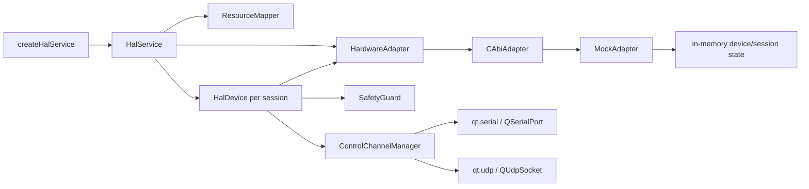

# HAL 实现设计报告

> 快照日期：2026-07-19
> 本文定位：记录 `src/hal/` 的当前代码结构、真实调用路径、已知限制和向目标 Provider 架构的迁移顺序。
> 稳定接口与目标语义见 [HAL 层接口协议](../contracts/hal-interface-protocol.md)；测试规则见 [测试规范](../testing/testing-specification.md)。
> 本报告不重复公共头声明、稳定错误码、日志字段映射或全局测试命令。

---

## 1. 结论

当前 HAL 已实现资源映射、基础安全校验、会话、既有硬件接口和控制通道。控制资源可按配置选择 Qt 串口或 UDP；其他资源仍使用兼容 Mock 后端：

```text
控制：HalDevice -> ControlChannelManager -> qt.serial / qt.udp -> Qt 标准 API
其他：HalService -> CAbiAdapter -> MockAdapter -> 内存状态
```

已确认的目标是：

```text
目标：HalService -> providerId Router
                   -> Mock Provider
                   -> Vendor Adapter Provider -> C ABI -> 厂家库/驱动
                   -> Qt Serial/TCP/UDP Provider -> Qt 标准 API
```

当前只在 `module = "control"` 的资源上实现局部 `providerId` 路由。没有通用 Router、控制通道 Mock Provider、TCP、真实厂家 DLL 调用或真实硬件证据；也没有定义 `INetworkBus`。

---

## 2. 构建与目录

`src/hal/CMakeLists.txt` 生成 `hwtest_hal`。公共头位于 `src/hal/include/hal/`，内部实现位于 `src/hal/src/`；模块公开链接 Qt Core，私有使用 Qt Network/SerialPort，并依赖根工程注入三个 Qt 目标。当前没有可直接执行 `cmake -S src/hal` 的独立自举入口。

内部文件职责：

| 文件/类 | 当前作用 |
| --- | --- |
| `hal_factory.cpp` | 创建和销毁 `IHalService` |
| `HalService` | 初始化、资源表、后端、设备会话和服务日志 |
| `HalDevice` | 会话内资源校验、I/O 转发和安全关闭 |
| `ControlChannelManager` | 解析控制资源 `providerId`，持有单个已打开 Qt Provider 并补齐错误上下文 |
| `QtSerialControlProvider` | 按资源属性持有 `QSerialPort`，执行打开、总预算写入、短读和关闭 |
| `QtUdpControlProvider` | 按资源属性持有 `QUdpSocket`，执行绑定、远端来源过滤、数据报读写、大小校验和关闭 |
| `ResourceMapper` | 从配置构造设备、资源、能力和 safe state |
| `SafetyGuard` | 模拟量、数字量、串口和 CAN 基础参数校验 |
| `HardwareAdapter` | HAL 内部 C++ 后端抽象 |
| `CAbiAdapter` | 当前兼容 seam；实际全部转发给 `MockAdapter` |
| `AdapterLoader` | 可加载 DLL 并解析 ABI v1 入口，但未接入主链 |
| `MockAdapter` | 内存设备、回环和 echo 后端 |
| `HalErrorMapper` | C ABI 状态到 `HalStatusCode` 的当前映射 |

---

## 3. 当前对象关系



`HardwareAdapter` 已隔离 `HalService` / `HalDevice` 与具体后端，但当前它只是单后端抽象，不是按 `providerId` 分派的 Router。

---

## 4. `HalService` 当前流程

### 4.1 初始化

```text
initialize(halConfig)
  -> shutdown() 清理旧状态
  -> ResourceMapper.load(halConfig)
  -> createBackend(halConfig)
  -> 固定创建 CAbiAdapter
  -> CAbiAdapter.initialize()
  -> MockAdapter.initialize()
  -> m_initialized = true
```

`createBackend()` 当前忽略配置并总是返回 `CAbiAdapter`。`CAbiAdapter` 又持有一个 `MockAdapter` 并逐方法转发，因此 `adapterId`、库路径或设备类型不会改变实际后端。

### 4.2 扫描与能力

`scanDevices()` 返回 `ResourceMapper::devices()`；`queryCapabilities()` 返回 `ResourceMapper::capabilities()`。两者不调用 `HardwareAdapter::enumerateDevices()` 或 `queryCapabilities()`，所以当前“发现结果”是配置推导值，不是物理设备证据。

### 4.3 打开与会话

`openDevice()`：

1. 检查初始化状态和配置中的设备描述；
2. 调后端创建 `SessionId`；
3. 取该设备的资源绑定和安全态；
4. 创建 `HalDevice` 并存入 `m_sessions`；
5. 发出设备状态和操作日志。

`device(sessionId)` 返回内部 `HalDevice*`；调用方不得让该指针超过服务或会话生命周期。`closeDevice()` 先调用 `HalDevice::close()`，随后从会话表删除。

### 4.4 关闭

`shutdown()` 遍历会话调用 `HalDevice::close()`，清空会话，再关闭和释放后端。方法是幂等的，析构也会调用它。

当前实现会尝试安全收尾，但未汇总并返回所有关闭错误；真实物理安全效果也尚无厂家后端或硬件测试证明。

---

## 5. 当前配置与资源模型

`ResourceMapper` 当前读取：

```text
hardware.devices[]
hardware.resources{}
safeState{}
```

设备字段包含 `alias`、`adapterId`、厂商/型号/序列号等描述；资源字段包含逻辑 ID、设备 alias、模块、方向、`physicalIndex` 和属性。资源表只负责 `ResourceId -> 物理资源描述`，不解释 CSV 或产品协议。

为了无配置开发，当前有宽松回退：

- 无设备时创建 `mock_device_0`；
- 无资源时创建 AD、DA、DI、DO、串口和 CANFD 六个默认资源；
- 未知设备引用可能绑定到第一个设备；
- 缺少 `adapterId` 时回退 `mock.adapter.v1`；
- 能力和部分限制值从资源配置推导或固定填入。

这些行为适合 Mock 开发，不适合生产部署。目标 Provider 路由落地后，生产配置应显式提供 `providerId` 和设备 match；缺失或匹配不唯一必须失败，不得静默选择 Mock 或首个设备。

当前配置示意：

```json
{
  "hardware": {
    "devices": [
      {"alias": "main_daq", "adapterId": "mock.adapter.v1"}
    ],
    "resources": {
      "SERIAL_A": {
        "device": "main_daq",
        "module": "serial",
        "direction": "bidirectional",
        "physicalIndex": 0
      }
    }
  },
  "safeState": {
    "SERIAL_A": {"action": "close"}
  }
}
```

该示例是当前兼容形状，不是目标 `providerId` 配置；目标骨架只在 HAL 契约中定义。

---

## 6. `HalDevice` 当前行为

`HalDevice` 同时实现 `IHalDevice`、`IAnalogIo`、`IDigitalIo`、`ISerialBus` 和 `ICanFdBus`。每次操作先检查：

```text
会话已打开
  -> ResourceId 存在
  -> module 匹配
  -> direction 匹配或为 bidirectional
  -> 输出类操作通过 SafetyGuard
  -> 转换为 physicalIndex 后调用 HardwareAdapter
```

### 6.1 模拟量和数字量

- AD/DA 配置会缓存量程；读结果的通道会改写回逻辑 `ResourceId`。
- DA 写入使用显式量程或资源安全属性，支持拒绝越界或 `safeClamp` 钳位。
- DO 禁止写 input 和 `Unknown`；DI/DO 批量方法当前逐项调用，首错即停。
- `waitEdge()` 只转发后端；Mock 当前立即返回目标电平，不模拟真实等待。

### 6.2 串口

`openSerial()` 缓存配置并调用后端；`writeSerial()` / `readSerial()` 执行原始字节操作。

当前 `transactSerial()`：

```text
backend.writeSerial(tx, transaction.op)
  -> backend.readSerial(readMaxBytes, transaction.op)
  -> 返回 rx 和时间戳
```

已确认限制：

- 写和读分别使用同一个 `timeoutMs`，不是共享总 deadline；
- 不累积多次读取；
- 不保证完整产品帧；
- `expectedPrefix`、`readMinBytes`、`terminator` 未参与判定；
- Mock metadata 中保留 `expectedPrefix` 仅是兼容遗留，不代表校验。

这些限制符合“HAL 不解析产品协议”的边界，但流式累积必须由算法传输实现补齐。

### 6.3 CAN/CANFD

HAL 校验普通 CAN payload 不超过 8 字节、CANFD 不超过 64 字节，并转发过滤、发送和接收。当前批量接收和部分辅助操作缺少完整操作日志；payload 产品语义不属于 HAL。

### 6.4 安全关闭

`HalDevice::close()` 先执行 `applySafeState()`，再关闭后端会话。当前支持：

- analog output 写安全值；
- digital output 写安全电平；
- serial 关闭端口；
- canfd 关闭总线。

实现保留第一个后端错误并继续处理后续资源。不存在的安全资源会被忽略。此机制目前只在 Mock 路径验证，尚未形成真实硬件安全证据。

---

## 7. 后端、Loader 与 ABI

### 7.1 `HardwareAdapter`

`HardwareAdapter` 覆盖设备生命周期、模拟/数字 I/O、串口和 CAN/CANFD，是当前 HAL 私有后端接口。公共 HAL 头不暴露它。

目标实现可在该边界上演化 Provider Router，但需要先明确单设备多 Provider、连接所有权和 capability 合并规则；不能简单把 `HardwareAdapter` 改名后宣称路由已完成。

### 7.2 `CAbiAdapter`

名称容易造成误解：当前 `CAbiAdapter` 没有加载 DLL，也没有调用 `HalAdapterApiV1`。它的所有方法直接委托成员 `MockAdapter`。

因此当前事实是：

```text
createBackend() -> CAbiAdapter -> MockAdapter
```

目标中，C ABI 应只位于 Vendor Adapter Provider 内。Qt Provider 和 Mock Provider 不应绕经 Vendor C ABI。

### 7.3 `AdapterLoader` 与 ABI v1

`AdapterLoader` 已实现：

- 使用 `QLibrary` 加载指定 DLL；
- 解析 `hal_adapter_get_api_v1`；
- 校验 ABI 版本和 `structSize`；
- 保存函数表并在析构时卸载。

但它未接入 `HalService::createBackend()` 或 `CAbiAdapter`，所以 Loader 单测只能证明加载器本身，不能证明真实 Adapter 调用链。

`hal_adapter_abi.h` 当前为 ABI v1。兼容规则和状态边界见 HAL 契约，不在本报告重复。

---

## 8. `MockAdapter` 当前能力

`MockAdapter` 使用内存表维护设备、会话和 I/O 状态：

| 类型 | 当前模拟 |
| --- | --- |
| 模拟量 | 输出记录、同物理通道回环、可选随机噪声 |
| 数字量 | 输出记录、同物理通道回环 |
| 串口 | 写入 buffer，读取 echo；空 buffer 可返回 `mock-serial` |
| CAN/CANFD | 发送帧入队，接收出队 |
| 会话 | 初始化、打开、关闭、复位、健康检查 |

当前 Mock 不模拟真实时间、并发、设备断开、可编排错误注入或产品协议设备行为。串口 echo 与 `SystemStatusSimulator` 是两个不同层次：前者验证原始 HAL I/O，后者验证产品协议但绕过 HAL。

目标产品模拟应把设备行为放到 HAL Mock Provider 后方，使算法仍通过 HAL 资源和生命周期完成测试。

---

## 9. 算法层与应用接入现状

`src/algorithm` 已实现当前产品路径 `HalControlTransport`：构造时接收 `IHalDevice*` 和逻辑 `ResourceId`，通过 `IControlChannel` 打开、原始读写和关闭；它在算法层完成 MB_DDF 同步字搜索、短读累积、长度分帧和剩余帧保留。旧 `HalSerialTransport` 继续作为 `ISerialBus` 兼容桥接。

当前限制：

- 传输对象不创建或拥有 `IHalService` / 设备会话，`hwtest_pc_runner` 负责按配置建立和收尾会话；
- `SystemStatusAlgorithmExecutor` 每次 BIZ 重试都独立打开/关闭控制资源，并保持同一请求序号；
- `configs/mbddf_pc_hal.json` 同时定义串口和 UDP 资源，`control.resourceId` 是 PC 每次运行前的唯一选择点；
- 当前只有 `mbddf.system_status`，图形 UI 和运行期热切换未实现。

Qt UDP 本机模拟目标闭环已经打通；真实 Windows 串口、现场网络端点和 DUT 闭环尚无证据。

---

## 10. 错误与日志现状

`HalErrorMapper` 当前把 Vendor ABI 风格状态码直接映射为 `HalStatusCode`。其中 `protocol error -> ProtocolError` 只是现有兼容映射，不能用于产品帧 CRC、字段、命令或序号错误；来源不明时目标实现应使用 `AdapterError` 并保留原始诊断。

`HalService` 和 `HalDevice` 会产生 `HalLogEvent`，但 `flushSerial()`、`setCanFilters()`、`receiveCanBatch()` 等路径尚未完全覆盖。HAL 到日志服务的桥接在 `src/logging/`，字段唯一语义见 [日志接口协议](../contracts/log-interface-protocol.md)。

---

## 11. 与目标契约的差距

| 差距 | 当前风险 | 目标动作 |
| --- | --- | --- |
| Router 只覆盖控制资源 | 其他资源仍无法显式选择 Qt/Vendor/Mock | 扩展统一 Provider 生命周期和配置校验 |
| Mock 静默默认 | 生产误连 Mock 或首设备 | 生产模式缺配置即失败 |
| Qt Provider 证据不完整 | 串口和现场 UDP 行为未知 | 隔离串口联调并确认现场 UDP 端点；TCP 另行评审 |
| Vendor 调用链缺失 | ABI/Loader 与运行时脱节 | 在 Vendor Provider 内接入 ABI v1 |
| 扫描来自配置 | 无法证明物理设备身份 | Provider 扫描并按 match 唯一绑定 |
| deadline 非端到端 | write/read 累计超时 | 单调时钟计算剩余预算 |
| 旧 `HalSerialTransport` 无流式缓冲 | 误用旧路径会受短读影响 | 产品路径固定使用 `HalControlTransport`，后续评估删除旧桥接 |
| 产品 Mock 绕过 HAL | 无法验证资源和安全链 | 算法经 HAL Mock Provider 闭环 |
| 安全态只在 Mock 证明 | 真实硬件风险未知 | 厂家/Qt Provider 契约和硬件验收 |

---

## 12. 建议迁移顺序

1. 在已实现的控制资源路由上补齐连接取消和更完整的 Provider 日志证据。
2. 用虚拟或隔离真实串口验证 614400/8E1、短读、拆包、超时和拔插收尾。
3. 确认 PC 到 DUT 的实际 UDP 地址/端口；不得复用板端网口自环测试事实作推断。
4. 把当前 `MockAdapter` 迁为直接的 Mock Provider，并补 SYSTEM_STATUS 控制通道闭环。
5. 把 `AdapterLoader + HalAdapterApiV1` 接入 Vendor Adapter Provider，保留 ABI v1 兼容测试。
6. 统一全 HAL deadline、连接取消、日志覆盖和异常安全收尾；TCP 在实际用例明确后另行评审。
7. 完成隔离真实 DUT 验收，再扩充更多 MB_DDF 测试项和图形 UI。

每一步都应先更新 HAL 契约和测试边界，再修改实现；目标能力在通过相应测试前继续标记“未实现”。
